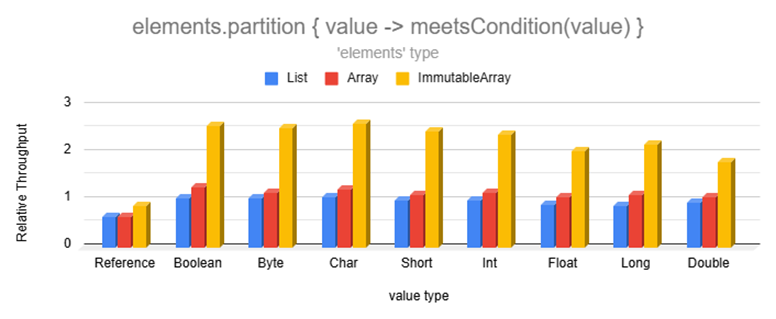
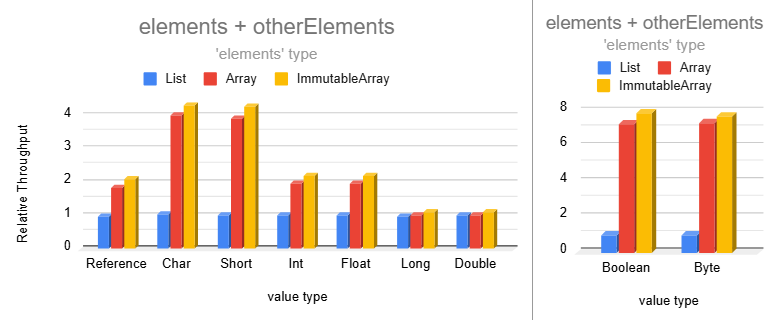

# Benchmarks

* [Results](#results)
    * [Copy Operations](#copy-operations)
    * [Transformation Operations](#transformation-operations)
    * [Condition Operations](#condition-operations)
* [Summary](#benchmark-summary)

<details>
<summary>Benchmark Setup</summary>

Benchmarks use the [Java Microbenchmark Harness](https://github.com/openjdk/jmh) to ensure accurate results.

1,000 collections are randomly generated with sizes chosen from the following probability distribution in order to
resemble the real world:

- 35% between 0 and 10 elements
- 30% between 11 and 50 elements
- 20% between 51 and 200 elements
- 10% between 201 and 1,000 elements
- 5% between 1,001 and 10,000 elements

To measure the performance of an operation, we measure how many collections can be processed per second. This is
repeated across 27 configurations: 3 collection types (lists, arrays, & immutable arrays) and 9 data types (Boolean,
Int, String, etc.). When measuring the performance of a data type across the 3 collection types, each collection
operates on identical, randomly-generated data. See benchmark sources
in [pods4k-benchmarks](https://github.com/daniel-rusu/pods4k-benchmarks) for full details.

Results are normalized to list performance

- 1,000 ops/sec for lists vs. 1,500 for arrays = relative throughput of 1.5.

</details>

<details>
<summary>Value types</summary>

There are 9 Immutable Array types in this library. A generic `ImmutableArray<T>` and a primitive type for each of the 8
base types, such as `ImmutableIntArray`. Since regular arrays also have primitive variants, like-for-like comparisons
are made with regular arrays (eg.`ImmutableFloatArray` vs.`FloatArray`).

The Immutable Arrays library makes every effort to minimize auto-boxing without sacrificing readability so that clean
code is efficient by default. Developers write natural-looking code without thinking about primitives or auto-boxing and
the library automatically binds to the most efficient specialization:

```kotlin
val names = immutableArrayOf("Dan", "Jill") // ImmutableArray<String>
val luckyNumbers = immutableArrayOf(1, 2, 3) // ImmutableIntArray!!!
```

Even when starting with a generic type, we often perform operations on its constituent primitive properties. Immutable
Arrays automatically binds transformation operations, such as the `map` operation, to the most efficient specialization:

```kotlin
val people = immutableArrayOf(dan, bob, jill) // ImmutableArray<Person>

val weights = people.map { it.weightKg } // ImmutableFloatArray!!!
// Operate on weights with improved performance and efficiency
```

Benchmarking 9 value types (generic + 8 primitive types) aligns with the most natural usage of this library as
primitives are automatically used whenever possible.

</details>

## Results

### Copy Operations

Operations that copy ranges of values have significantly higher performance than lists and even regular arrays. The
smaller data types are split into a separate chart to avoid skewing the chart axis since their performance is too high!


Copy operations on lists or regular arrays accumulate values into an ArrayList one element at a time. However, the same
operations on immutable arrays generate immutable arrays, so we can copy entire ranges of values with the low-level
arraycopy function which uses bulk memory operations to copy multiple elements at a time.


The `takeWhile` & `takeLastWhile` operations perform similarly so we'll just show `takeWhile` for brevity.


The relative performance of the drop operations (`drop`, `dropLast`, `dropWhile`, & `dropLastWhile`) are similar or
higher than the `take` variants above. We're omitting those for brevity.

### Transformation Operations

Transformations are significantly faster than lists and even regular arrays:


Lists and regular arrays incur additional overhead as they accumulate values in an ArrayList. This repeatedly checks
for sufficient list capacity as each element is added. Transformations on immutable arrays generate immutable arrays
avoiding the ArrayList overhead. Additionally, immutable arrays operate on the 8 primitive types directly without
incurring the memory and performance overhead of auto-boxing and unboxing that lists introduce.


Note that regular arrays are slightly slower than lists here because the Kotlin standard library doesn't have a
`flatMap` function that operates on nested arrays. We used `elements.flatMap { it.nestedRegularArray.asList() }` as the
most efficient alternative for regular arrays since `asList()` returns a wrapper without copying the backing array.



Sorting becomes extremely fast for smaller data types!


Combining two immutable arrays into a larger one is much faster than lists for most data types:



### Condition Operations

Immutable arrays are much faster than lists for operations that inspect the data when dealing with one of the 8 base
types:


Lists store generic types forcing primitive values to be auto-boxed. This makes inspecting their values slower as the
wrapper object introduces an extra layer of indirection.

## Benchmark Summary

Immutable arrays are between 2 to 8 times faster than lists for many common operations with some scenarios over 30 times
faster!  Although there are many more operations, the above results should provide a pretty good representation of the
performance improvement of common non-trivial operations.