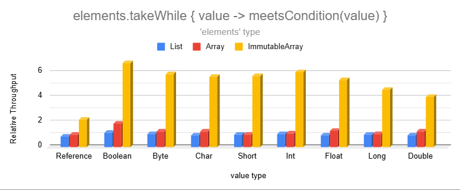
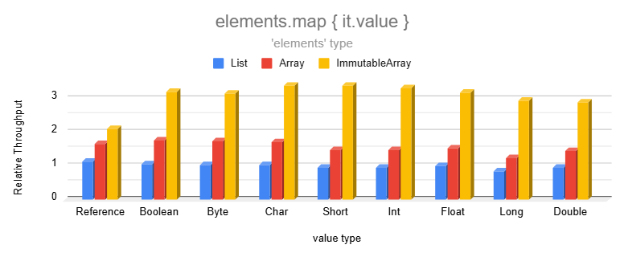
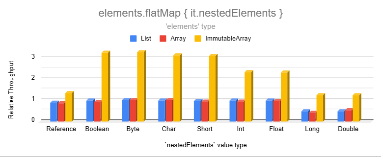
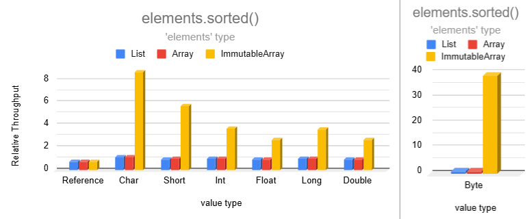
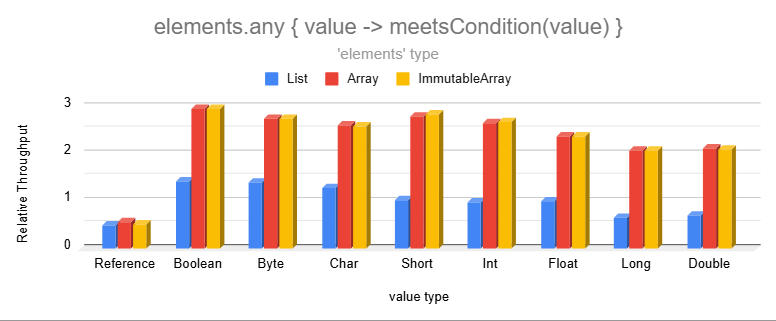

# Benchmarks

* [Results](#results)
    * [Copy Operations](#copy-operations)
    * [Conditional Copy Operations](#conditional-copy-operations)
    * [Transformation Operations](#transformation-operations)
    * [Condition Operations](#condition-operations)
* [Summary](#benchmark-summary)

<details>
<summary>Benchmark Setup</summary>

### Measurement Process

Benchmarks use the [Java Microbenchmark Harness](https://github.com/openjdk/jmh) to ensure accurate results.

1,000 collections are randomly generated with sizes chosen from the following probability distribution in order to
resemble the real world:

- 35% between 0 and 10 elements
- 30% between 11 and 50 elements
- 20% between 51 and 200 elements
- 10% between 201 and 1,000 elements
- 5% between 1,001 and 10,000 elements

To measure the performance of an operation, we measure how many collections can be processed per second. This is
repeated across 27 configurations: 3 collection types (lists, arrays, & immutable arrays) and 9 data types (Boolean,
Int, String, etc.). When measuring the performance of a data type across the 3 collection types, each collection
operates on identical, randomly-generated data. See benchmark sources
in [pods4k-benchmarks](https://github.com/daniel-rusu/pods4k-benchmarks) for full details.

### Result Normalization

The relative throughput allows us say that an operation is `X` times faster when switching from one data structure to
another without talking about the exact throughput since that's dependent on the machine. So results are normalized
relative to the median list performance in each chart. Normalizing all results against the same value is important as
that allows us to gauge the impact of switching data structures, and also the impact of different data types.

**Example calculation:**

| Operation Performed On | Operation Throughput | Relative Throughput |
|------------------------|----------------------|---------------------|
| `List<Boolean>`        | `1,200` ops/sec      | `1.2`               |
| `List<Int>`*           | `1,000` ops/sec      | `1.0`               |
| `List<Float>`          | `900` ops/sec        | `0.9`               |
| `BooleanArray`         | `2,400` ops/sec      | `2.4`               |
| `IntArray`             | `2,000` ops/sec      | `2.0`               |
| `FloatArray`           | `1,800` ops/sec      | `1.8`               |

* Everything is normalized relative to `List<Int>` in this hypothetical example as that's the median list performance.

</details>

<details>
<summary>Value types</summary>

There are 9 Immutable Array types in this library. A generic `ImmutableArray<T>` and a primitive type for each of the 8
base types, such as `ImmutableIntArray`. Since regular arrays also have primitive variants, like-for-like comparisons
are made with regular arrays (eg.`ImmutableFloatArray` vs.`FloatArray`).

The Immutable Arrays library makes every effort to minimize auto-boxing without sacrificing readability so that clean
code is efficient by default. Developers write natural-looking code without thinking about primitives or auto-boxing and
the library automatically binds to the most efficient specialization:

```kotlin
val names = immutableArrayOf("Dan", "Jill") // ImmutableArray<String>
val luckyNumbers = immutableArrayOf(1, 2, 3) // ImmutableIntArray!!!
```

Unlike lists or regular arrays, working with Immutable Arrays makes it natural to end up operating on primitives even
when starting with generic types:

```kotlin
// people is an ImmutableArray<Person>
val weightsInKilograms = people.map { it.weightKg } // ImmutableFloatArray since weightKg is a Float
// ...

// Extra-fast without any extra developer effort!
val babyIsPresent = weightsInKilograms.any { it < 5.0f }
```

Benchmarking 9 value types (generic + 8 primitive types) aligns with the most natural usage of this library as
primitives are automatically used whenever possible.

</details>

## Results

### Copy Operations

Operations that copy ranges of values have significantly higher performance than lists and even regular arrays. The
smaller data types are split into a separate chart to avoid skewing the chart axis since their performance is too high!


Copy operations on lists or regular arrays produce lists accumulating values one element at a time. However, Immutable
Array operations generate immutable arrays to maintain immutability, so we can use arraycopy to copy memory in bulk and
avoid per-element bound checks.


The `drop` and `dropLast` operations have similar relative performance. Omitting those for brevity.

### Conditional Copy Operations

Operations that conditionally copy elements can be significantly faster than lists and regular arrays



These are much faster because producing an Immutable Array allows us to find the cutoff point and copy memory in bulk.


The `dropWhile` and `dropLastWhile` operations have even higher relative performance. Omitting those for brevity.

### Transformation Operations

Transformations are significantly faster than lists and even regular arrays:



Immutable Arrays are faster than lists or regular arrays because they produce Immutable Arrays in order to maintain
immutability. This skips the list capacity check for each element and also avoids auto-boxing when transforming elements
into one of the 8 primitive types.



Note that `flatMap` on regular nested arrays is slightly slower than lists because the Kotlin standard library doesn't
have an overload for that. We used `elements.flatMap { it.nestedRegularArray.asList() }`as the most efficient
alternative since `asList()` returns a wrapper without copying the backing array.


Sorting becomes extremely fast for smaller data types!



Combining two immutable arrays into a larger one is much faster than lists for most data types:


### Condition Operations

Immutable arrays are much faster than lists for operations that inspect the data when dealing with one of the 8 base
types:



Lists store generic types forcing primitive values to be auto-boxed. This makes inspecting their values slower as the
wrapper object introduces an extra layer of indirection.

## Benchmark Summary

Immutable arrays are between 2 to 8 times faster than lists for many common operations with some scenarios over 30 times
faster!  Although there are many more operations, the above results should provide a pretty good representation of the
performance improvement of common non-trivial operations.

We don't usually think about primitives in Kotlin and the same is true with Immutable Arrays. However, although we just
focus on writing clean list-like code, Immutable Arrays automatically use primitives when possible:

```kotlin
// primitive ImmutableFloatArray since weightKg is a Float
val weightsInKilograms = people.map { it.weightKg }

// Extra-fast while looking the same as regular list code
val babyIsPresent = weightsInKilograms.any { it < 5.0f }
```
