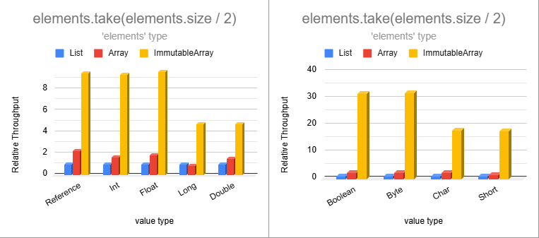
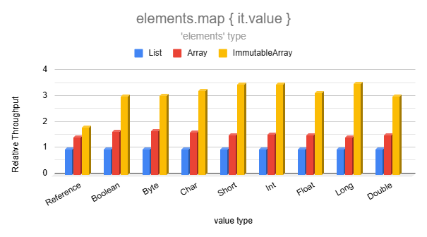
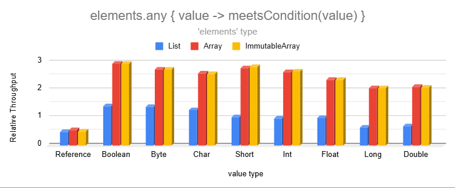
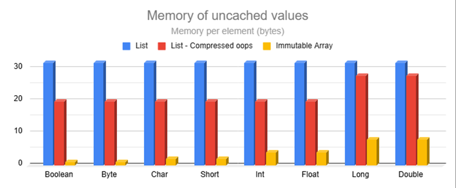
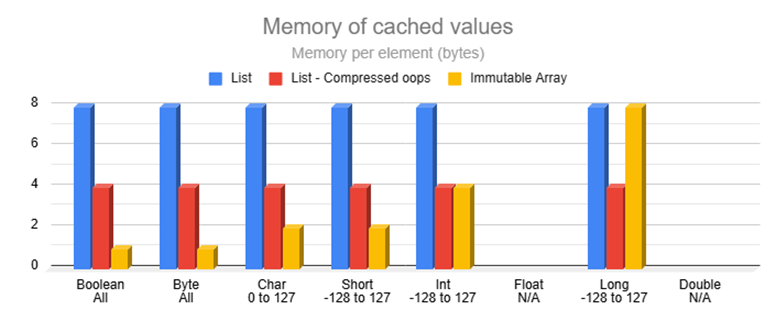
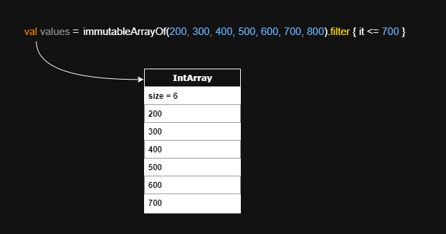
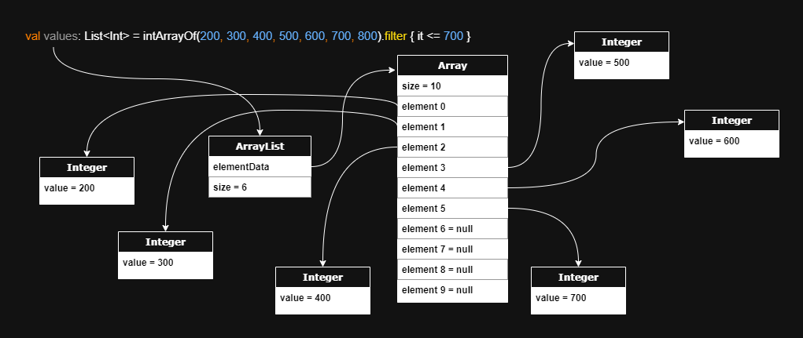

# Immutable Arrays

**Immutable Arrays** are a safer and more efficient alternative to lists in Kotlin while maintaining familiar syntax.
They are inline classes that compile to regular arrays while eliminating mutating abilities and replacing common
operations with highly-optimized versions.

* **Clean & Familiar**: List-like syntax ensures clean code and easy adoption.
* **Fast**: [2 - 8X faster than lists](BENCHMARKS.md) for most operations!
* **Memory Efficient**: [4X memory reduction](#memory-efficiency) in most scenarios!
* **True Immutability**: Cannot be mutated through casting.
* **Type Safety**: Prevents accidental mutation attempts at compile time.
* **Efficient Builders**: Accumulate elements more efficiently than mutable lists.

Ideal for Android, backend services, and any performance-critical or memory-constrained application. If you find this
library useful, please consider giving it
a [](https://github.com/daniel-rusu/pods4k)
on [GitHub](https://github.com/daniel-rusu/pods4k) and sharing it with others.

* [Quick Start](#quick-start)
* [Performance](#performance)
* [Memory Efficiency](#memory-efficiency)
* [Advanced Usage](#advanced-usage)
* [Comparison with Alternatives](#comparison-with-alternatives)
* [Caveats](#caveats)

## Quick Start

<a href="https://github.com/daniel-rusu/pods4k/releases/latest" alt="Activity"></a>
is available from Maven Central. See [dependency instructions](../README.md#installation) for more details.

```kotlin
repositories {
    mavenCentral()
}
dependencies {
    implementation("com.danrusu.pods4k:pods4k:<version_number>")
}
```

Usage looks the same as lists after construction:

```kotlin
val people = immutableArrayOf(dan, jill, bobby) // ImmutableArray<Person>

for (person in people) {
    sendMarketingEmailTo(person)
}
val employedPeople = people.filter { it.isEmployed() }
val salaries = employedPeople.map { it.salary }
```

## Performance

Immutable Arrays are 2 to 8X faster than lists for most operations with some much faster. They often outperform regular
arrays as operations were replaced with highly-optimized versions that preserve immutability. Immutability also enables
skipping operations when inferring identical results.

Here's a sneak peek from the [Benchmarks page](BENCHMARKS.md):



Smaller data types are separated on the right to avoid skewing the axis as their performance is too high.



Elements can be inspected much faster than lists when dealing with the 8 base types:



The [Benchmarks page](BENCHMARKS.md) has more surprising results along with performance explanations.

## Memory Efficiency

### Zero-memory scenarios

Unlike lists, immutability enables re-using instances in many scenarios instead of creating new collections:

<details>
<summary>Scenarios that return same instance</summary>

The following scenarios return `this` without allocating any memory:

| Operation                         | Returns `this` when                 |
|-----------------------------------|-------------------------------------|
| `take(n)`                         | `n >= size`                         |
| `takeWhile { condition }`         | all elements meet the condition     |
| `takeLast(n)`                     | `n >= size`                         |
| `takeLastWhile { condition }`     | all elements meet the condition     |
| `drop(n)`                         | `n == 0`                            |
| `dropWhile { condition }`         | first element fails condition       |
| `dropLast(n)`                     | `n == 0`                            |
| `dropLastWhile { condition }`     | last element fails condition        |
| `sorted()`                        | `size <= 1`                         |
| `sortedDescending()`              | `size <= 1`                         |
| `sortedBy { selector }`           | `size <= 1`                         |
| `sortedByDescending { selector }` | `size <= 1`                         |
| `sortedWith(comparator)`          | `size <= 1`                         |
| `shuffled()` & `shuffled(random)` | `size <= 1`                         |
| `distinct()`                      | `size <= 1`                         |
| `distinctBy { selector }`         | `size <= 1`                         |
| `plus(otherArray)`                | `otherArray.isEmpty()` & vice versa |

These scenarios allocate a temporary builder to keep track of the elements and discard that returning the same instance
when discovering that all elements were added:

| Operation                     | Returns `this` when               |
|-------------------------------|-----------------------------------|
| `filter { condition }`        | all elements meet the condition   |
| `filterIndexed { condition }` | all elements meet the condition   |
| `filterNot { condition }`     | all elements fail the condition   |
| `distinct()`                  | all elements are distinct         |
| `distinctBy { selector }`     | selector produces distinct values |

</details>

<details>
<summary>Scenarios that return EMPTY singleton</summary>

These scenarios return the `EMPTY` singleton without allocating any memory:

| Operation                                           | Returns `EMPTY` singleton when      |
|-----------------------------------------------------|-------------------------------------|
| `emptyImmutableArray()` & 8 primitive variants      | always                              |
| `immutableArrayOf()`                                | no arguments provided               |
| `ImmutableArray(n) { init }` & 8 primitive variants | `n == 0`                            |
| `regularArray.toImmutableArray()`                   | `isEmpty()`                         |
| `copyFrom(array, startIndex, size)`                 | `size == 0`                         |
| `take(n)`                                           | `n == 0`                            |
| `takeWhile { condition }`                           | first element fails condition       |
| `takeLast(n)`                                       | `n == 0`                            |
| `takeLastWhile { condition }`                       | last element fails condition        |
| `drop(n)`                                           | `n >= size`                         |
| `dropWhile { condition }`                           | all elements fail condition         |
| `dropLast(n)`                                       | `n >= size`                         |
| `dropLastWhile { condition }`                       | all elements fail condition         |
| `map { selector }`                                  | `isEmpty()`                         |
| `mapIndexed { selector }`                           | `isEmpty()`                         |
| `sorted()`                                          | `isEmpty()`                         |
| `sortedDescending()`                                | `isEmpty()`                         |
| `sortedBy { selector }`                             | `isEmpty()`                         |
| `sortedByDescending { selector }`                   | `isEmpty()`                         |
| `sortedWith(comparator)`                            | `isEmpty()`                         |
| `shuffled()` & `shuffled(random)`                   | `isEmpty()`                         |
| `distinct()`                                        | `isEmpty()`                         |
| `distinctBy { selector }`                           | `isEmpty()`                         |
| `plus(otherArray)`                                  | `isEmpty() && otherArray.isEmpty()` |
| `toTypedImmutableArray()`                           | `isEmpty()`                         |
| `zip(other)`                                        | `isEmpty()` or `other.isEmpty()`    |

These scenarios allocate temporary memory to keep track of elements and return the `EMPTY` singleton after no elements
were added:

| Operation                                               | Returns `EMPTY` singleton when    |
|---------------------------------------------------------|-----------------------------------|
| `ImmutableArray.Builder.build()` & 8 primitive variants | `isEmpty()`                       |
| `immutableArrayOfNotNull(...)`                          | all arguments are null            |
| `buildImmutableArray { ... }` & 8 primitive variants    | no elements added                 |
| `iterable.toImmutableArray()`                           | the iterable is empty             |
| `sequence.toImmutableArray()`                           | the sequence is empty             |
| `filter { condition }`                                  | all elements meet the condition   |
| `filterIndexed { condition }`                           | all elements meet the condition   |
| `filterNot { condition }`                               | all elements fail the condition   |
| `filterNotNull()`                                       | all elements are null             |
| `mapNotNull { selector }`                               | all elements are null             |
| `mapIndexedNotNull { selector }`                        | all elements are null             |
| `distinct()`                                            | all elements are distinct         |
| `distinctBy { selector }`                               | selector produces distinct values |
| `flatMap { selector }`                                  | all nested collections are empty  |
| `flatten()`                                             | all nested arrays are empty       |

</details>

Additionally, some operations re-use instances for a portion of the results. For example, `partition` returns
`Pair(this, EMPTY)` or `Pair(EMPTY, this)` when all elements end up on same side.

### Memory of uncached values

The following shows the memory consumption of storing uncached values (wrapper header + value + padding + reference):



Regular arrays aren't included as most regular-array operations produce lists resulting in the above memory consumption.

### Memory of cached values

<details>
<summary>The JVM maintains a cache of small boxed values</summary>

* All `Boolean` and `Byte` values.
* `Char` ASCII values between `0` and `127`.
* `Short`, `Int`, & `Long` values between `-128` and `127`.

</details>

<details>
<summary>The cache is bypased in many scenarios</summary>

* `Float` & `Double` values are never cached
* Values that are out of range, such as `128`, aren't cached
* Manually calling the constructor bypasses the cache
    * E.g. `java.lang.Boolean(true)`, `java.lang.Integer(0)`, etc.
* Generic utilities that use reflection to call constructors bypass the cache
* etc.

</details>

The memory of storing references to cached wrappers is often much higher than storing the values themselves:



The cache hit rate is highest when working with `Boolean`, `Byte`, and `Char` data types. However, storing references to
these cached wrappers takes 2 - 8X more memory than storing the values themselves!

<details>
<summary>Int memory consumption is reduced by over 3X in most scenarios</summary>

`Int` values are cached between 0% to 100% of the time depending on your use-case. Some use-cases, such as storing a
person's age, have most values within the `-128 to 127` caching range. Other use-cases are almost always out of caching
range, such as when storing IDs, counters, prices in cents, etc. Even use-cases with tiny values might bypass the cache
if they're created by calling the constructor, such as via generic reflection utilities etc.

Using `P` as the percentage of `Int` values that are cached, the Immutable Array weighted average memory reduction is
`cachedMemoryReduction*P + uncachedMemoryReduction*(1 - P)`. From the memory charts, the memory reduction is 1 or 5X
with JVM pointer compression enabled and 2 or 8X without, so the weighted average is:

* Compressed oops enabled: `1*P + 5*(1 - P)` = `5 - 4P`
* Compressed oops disabled: `2*P + 8*(1 - P)` = `8 - 6P`

Using these formulas for several percentages, we see that Immutable Arrays reduce memory consumption by at least 3X most
of the time:

| Cached Percentage | Int memory reduction | Int memory reduction <br>Compressed oops |
|-------------------|----------------------|------------------------------------------|
| 0%                | 8X                   | 5X                                       |
| 25%               | 6.5X                 | 4X                                       |
| 50%               | 5X                   | 3X                                       |
| 75%               | 3.5X                 | 2X                                       |
| 100%              | 2X                   | 1X                                       |

</details>

Cached `Long` is the only scenario with lower memory than Immutable Arrays assuming JVM pointer compression is enabled.
However, the majority of `Long` values are outside the tiny cache range and `Long` is chosen when anticipating larger
values. When using `Long` to store salaries in cents, only salaries up to $1.27 can be cached making the cache useless.

### Memory Layout

<details>
<summary>Immutable Arrays automatically use primitives</summary>

Here's an example where we code naturally and automatically benefit from primitives:



Note that the `values` Immutable Array variable directly references a primitive int array in the generated bytecode.

Immutable Array operations produce Immutable Arrays in order to preserve immutability guarantees. However, most
regular-array operations produce lists. Here's the resulting list memory layout of performing the same operation with a
regular primitive array:



Lists use generics so primitives are auto-boxed into wrapper objects and references to those wrappers are stored. The
`values` variable references an `ArrayList`, which references an over-sized array, which itself references wrapper
objects which finally store the primitive values.

Unlike lists or regular arrays, Immutable Arrays automatically switch to the most optimal type improving memory and
performance:

```kotlin
class Person(val name: String, val weightKg: Float)
//...
val people = immutableArrayOf(dan, bob, jill) // ImmutableArray<Person>

val weights = people.map { it.weightKg } // ImmutableFloatArray storing primitive floats!
```

</details>

Auto-boxing with lists increases memory consumption, adds extra indirection, reduces cache locality, and adds extra
pressure on the garbage collector.

### Memory Conclusion

Immutability enables many operations to use zero memory whereas the same operations on lists or regular arrays create
new collections. Immutable Arrays automatically use primitives reducing memory consumption, and they're always perfectly
sized whereas lists end up with unused wasted capacity for most operations.

Taking into account the average memory reduction for each data type and the smarter use of memory, Immutable Arrays are
expected to reduce memory consumption by over 4X in most scenarios.

## Advanced Usage

<details>
<summary>Creating Immutable Arrays</summary>

#### Regular Creation

```kotlin
// Empty Arrays
emptyImmutableArray<String>() // generic ImmutableArray<String>
emptyImmutableBooleanArray() // primitive ImmutableBooleanArray
// ...

// From Values
immutableArrayOf("Bob", "Jane") // ImmutableArray<String>
immutableArrayOf(1, 2, 3) // primitive int array
immutableArrayOf<Int>(1, 2, 3) // generic array with boxed integers

// Generated Elements
ImmutableArray(size = 3) { it.toString() } // ["0", "1", "2"]
ImmutableIntArray(size = 5) { it * it } // [0, 1, 4, 9, 16]

// From Existing Collections
listOfStrings.toImmutableArray() // ImmutableArray<String>
listOfIntegers.toImmutableArray() // primitive ImmutableIntArray
listOfIntegers.toImmutableArray<Int>() // generic ImmutableArray<Int>
// similarly with conversions from regular arrays or other iterables like Set, etc.


```

#### With Build Functions

We can use build functions when we don't know the resulting size in advance. This is more efficient than accumulating
values in a collection and converting that to an immutable array.

```kotlin
// Creates generic ImmutableArray<Person>
val adults = buildImmutableArray<Person> {
    for (person in people) {
        if (person.age >= 18) add(person)
    }
}

// Creates primitive ImmutableIntArray
val favoriteNumbers = buildImmutableIntArray {
    people.forEach { addAll(it.favoriteNumbers) }
}
```

#### With Builders

We can use immutable-array builders when accumulating values in more complex scenarios. Builders are more efficient than
accumulating values in a collection and converting that into an immutable array.

```kotlin
fun getTopStocks(): ImmutableArray<Stock> {
    val topStocksBuilder = ImmutableArray.Builder<Stock>()

    addTrendingStocks(topStocksBuilder)
    addFastestGrowingStocks(topStocksBuilder)

    return topStocksBuilder.build()
}

// primitive variants also have builders e.g. ImmutableBooleanArray.Builder()
```

</details>

<details>
<summary>Accessing Elements</summary>

#### By Position

```kotlin
val names = immutableArrayOf("Dan", "Bob", "Jill")

names[0] // "Dan"
val (first, _, third) = names // first = "Dan", third = "Jill"

// Special access methods
names.single() // similarly with singleOrNull()
names.first() // similarly with firstOrNUll()
names.last() // similarly with lastOrNull()
```

#### By Condition

```kotlin
val numbers = immutableArrayOf(1, 4, 5, 6)

val firstEvenNumber = numbers.first { it % 2 == 0 } // 4
val lastOddNumber = numbers.last { it % 2 == 1 } // 5
// similarly with firstOrNull { condition } and lastOrNull { condition }

numbers.single { it % 3 == 0 } // 6
// similarly with singleOrNull
```

</details>

<details>
<summary>Iterating Elements</summary>

```kotlin
val names = immutableArrayOf("Dan", "Bob", "Jill")

// For-Loop
for (name in names) {
    println(name)
}

// ForEach
names.forEach { println(it) }
names.forEachIndexed { index, name -> println("$index: name") }

// Sequence
names.asSequence()
    .filter { /* ... */ }
    .forEach { /* ... */ }

// Iterator
names.asIterable()

val iterator = names.iterator()
while (iterator.hasNext()) {
    //...
}
```

</details>

<details>
<summary>Conditions</summary>

#### Element Conditions

```kotlin
val names = immutableArrayOf("Dan", "Bobby", "Jill")

"Jill" in names // true
names.contains("Joe") // false
names.isEmpty() // false

names.all { it.isNotEmpty() } // true
names.any { it.startsWith("B") } // true
names.none { it.length > 10 } // true
// etc.
```

#### Array Equality Conditions

Regular equality works as expected. Kotlin prevents checking referential equality using `===` because Immutable Arrays
are inline classes that get erased at compile time. Use `referencesSameArrayAs` to check whether two variables reference
the same array instance:

```kotlin
val names = immutableArrayOf("Dan", "Jill")
val sameNames = immutableArrayOf("Dan", "Jill")

// true since they contain identical values
names == sameNames // regular equality

// false since they were created separately 
names.referencesSameArrayAs(sameNames) // referential equality of the array

// Immutability allows us to safely share instances behind the scenes
names.take(100).referencesSameArrayAs(names) // true
names.filter { it.isNotEmpty() }.referencesSameArrayAs(names) // true
// etc.
```

</details>

<details>
<summary>Transformations</summary>

```kotlin
val names = immutableArrayOf("Dan", "Bobby", "Jill")

names.map { it.length } // [3, 5, 4]
names.filter { it.length <= 4 } // ["Dan", "Jill"]
names.take(2) // ["Dan", "Bobby"]
names.sorted() // ["Bobby", "Dan", "Jill"]
names.partition { it.length % 2 == 0 } // Pair(["Jill"], ["Dan", "Bobby"])
// etc.
```

</details>

### Interop with List APIs

There are several ways to pass Immutable Arrays to functions that accept lists or iterables:

```kotlin
val people = immutableArrayOf(dan, bob, jill)

// copy to standalone read-only List
notifyPeople(people.toList())

// create an immutable List wrapper backed by the same array without copying elements
notifyPeople(people.asList())

// create an Iterable wrapper without copying the elements
notifyPeople(people.asIterable())
```

<details>
<summary>Adding Immutable Arrays to existing projects</summary>

Updating projects to use Immutable Arrays can be done in chunks rather than replacing all lists at once. This can be
tackled at the class, package, or module level. The boundaries that interact with other parts of the application can
expose Immutable Arrays as regular collections using `toList`, `asList`, or `asIterable`. As other parts of the
application get updated to work with Immutable Arrays, the boundary layers can be updated to operate on Immutable Arrays
directly for optimal efficiency.

Mutable lists that are used just to accumulate elements can be replaced with Immutable Array builders as those are much
more efficient.

</details>

<details>
<summary>Choosing between toList(), asList(), and asIterable()</summary>

When working with reference types, such as `ImmutableArray<Person>`, prefer `asList()` as that allows the flexibility of
random access and is extremely efficient since the generated wrapper is backed by the same backing array without copying
the elements.

When working with primitive variants, such as `ImmutableFloatArray`, exposing these to list APIs will auto-box elements
since lists use generics:

* If random access isn't needed, use `asIterable()` to avoid copying the backing array and nudge usages towards one-time
  access patterns with the iterator.
* Otherwise, if random access is needed and the number of accesses won't exceed the list size, use `asList()`.
* For everything else, use `toList()` to auto-box all values upfront and avoid additional auto-boxing when the same
  elements are accessed multiple times.

Using `asList()` or `asIterable()` only auto-boxes the elements that are accessed. For example, wrapping a 1,000-element
array by calling `asList()` and then performing 3 element accesses will only perform 3 auto-boxing operations.

Using `asList()` or `asIterable()` auto-boxes values lazily when accessed. This reduces the pressure on the garbage
collector for use cases that operate on the values without retaining the elements, such as when iterating the elements
to sum their values. Creating temporary wrapper objects that are immediately discarded is very efficient with modern
garbage collectors as the collection process only copies objects that are still accessible. Having 1 or 1,000 discarded
objects has no performance impact on the collection step. However, if we auto-box all elements up-front to pass to some
utility, any collections that occur before that utility completes would be forced to copy all these objects since
they're all still accessible.

</details>

<details>
<summary>Why Immutable Arrays don't implement the List interface</summary>

There are several reasons why Immutable Arrays shouldn't implement the `List` interface:

1. If the 8 primitive variants implemented the List interface, (eg.`ImmutableFloatArray` implemented `List<Float>`),
   elements would be auto-boxed on every access significantly affecting the memory and performance of the library.
2. As a quick test, we made `ImmutableArray<T>` implement the `List<T>` interface and found that the `List` extension
   functions from the Kotlin standard library overshadowed the optimized versions from this library. This significantly
   affects the memory and performance of this library and also breaks the immutability guarantees since the Kotlin
   standard library functions generate read-only lists that can be mutated through casting.
3. The `List` interface contains methods with `List` return types that we wouldn't want users to use. Using these would
   affect the memory and performance, but most importantly, this would make usages accidentally cross over into the list
   world where the immutability guarantees no longer exist. Throwing an `OperationNotSupportedException` would break the
   `List` contract breaking downstream usages in unpredictable ways.

</details>

## Comparison with Alternatives

| Feature                  | Immutable Arrays | Regular Arrays | Read-only Lists    | Unmodifiable Lists | Java Immutable Lists |
|--------------------------|------------------|----------------|--------------------|--------------------|----------------------|
| True Immutability        | ✅                | ❌              | ❌ <sup>1</sup>     | ❌ <sup>2</sup>     | ✅                    |
| Memory Efficiency        | ⭐⭐               | ⭐              | ❌                  | ❌                  | ❌                    |
| Performance              | ⭐⭐               | ⭐              | ❌                  | ❌                  | ❌                    |
| Compile-time Safety      | ✅                | ❌              | ✅ / ❌ <sup>1</sup> | ❌ <sup>3</sup>     | ❌ <sup>3</sup>       |
| Proper equals & hashCode | ✅                | ❌              | ✅                  | ✅                  | ✅                    |
| Meaningful toString()    | ✅                | ❌              | ✅                  | ✅                  | ✅                    |

<sup>1</sup> Casting enables mutation

<sup>2</sup> Mutable backing list

<sup>3</sup> Throws exceptions at runtime

### Benefits over regular arrays

<details>
<summary>Avoids equality & hashCode defects</summary>

Unlike regular arrays, Immutable arrays have proper equals & hashCode implementations allowing us to check structural
equality:

```kotlin
immutableArrayOf("Dan", "Bob") == immutableArrayOf("Dan", "Bob") // true

arrayOf("Dan", "Bob") == arrayOf("Dan", "Bob") // false despite identical contents
```

Since we can compare lists directly, developers occasionally attempt to do the same with regular arrays. Even worse,
defects can sneak in without obvious usages of these broken behaviors:

```kotlin
data class Order(val id: Long, private val products: Array<Product>)

val rejectedOrders = mutableSetOf<Order>()
// Oops, attempting to add Orders to a hashSet will make use of the auto-generated 
// equals & hashCode methods from the Order data class which will in turn rely on 
// the defective equals & hashCode implementation of regular arrays
```

Swapping `Array<Product>` with `ImmutableArray<Product>` will fix this defect scenario.

</details>

<details>
<summary>Safe asList() implementation</summary>

The `asList()` function is typically used to efficiently share regular arrays with APIs that operate on lists since this
creates a view wrapper that shares the same backing array without copying the elements. However, casting the wrapper
exposes a backdoor for mutating the original array:

```kotlin
val array = arrayOf("Dan", "Jill")
val list = namesArray.asList()

(list as MutableList<String>)[0] = "Bob"
array[0] // "Bob"!!!
```

Unlike regular arrays, calling `asList()` on an Immutable Array is safe as that returns a truly-immutable view backed by
the same array.

</details>

<details>
<summary>Meaningful toString()</summary>

Unlike regular arrays, calling `toString()` on immutable arrays produces a pretty representation of the data:

```kotlin
println(immutableArrayOf("Dan", "Bob")) // [Dan, Bob]  Nice!

println(arrayOf("Dan", "Bob")) // [Ljava.lang.String;@7d4991ad  Yuck!
```

</details>

<details>
<summary>Faster & more efficient operations</summary>

Regular arrays are chosen for memory or performance reasons, however most operations on regular arrays produce lists
so they lose these benefits while also incurring extra overhead from auto-boxing the values:

```kotlin
val weights = doubleArrayOf(1.5, 3.0, 10.2, 15.7, 2.0)
val largeWeights = weights.filter { it > 10.0 }
// Oops, this creates a List<Double> auto-boxing each value!
```

Unlike regular arrays, immutable arrays have specializations resulting in the most optimal representation so that clean
code is efficient by default:

```kotlin
val people = immutableArrayOf(
    Person(name = "Dan", age = 3),
    Person(name = "Bob", age = 4),
) // ImmutableArray<Person>

// Since the age field is a non-nullable Int, Mapping the ages uses an 
// efficient ImmutableIntArray storing primitive int values
val ages = people.map { it.age }
```

Here's a non-exhaustive list of operations that take advantage of primitives resulting in significant memory and
performance improvements over regular arrays:

* drop
* dropLast
* dropLastWhile
* dropWhile
* filter
* filterIndexed
* filterNot
* filterNotNull
* flatMap
* flatMapIndexed
* flatten
* map
* mapNotNull
* mapIndexed
* mapIndexedNotNull
* partition
* sorted
* sortedBy
* sortedByDescending
* sortedDescending
* sortedWith
* take
* takeLast
* takeLastWhile
* takeWhile
* etc.

</details>

<details>
<summary>Efficient sharing of encapsulated data</summary>

Regular arrays can have their elements reassigned making them a poor choice for encapsulated data that needs to be
shared. The only safe solution is to duplicate the contents before sharing so that callers can't mutate the encapsulated
array. Note that calling `asList()` on a generic array is not safe as the generated view can be cast into a
`MutableList` exposing a backdoor for mutating the original array. Additionally, calling `asList()` on a primitive
array, like `IntArray`, negatively affects memory and performance by auto-boxing elements every time they're accessed.

Immutable arrays can be safely shared resulting in cleaner and more efficient code.
</details>

### Benefits over read-only lists

<details>
<summary>Casting doesn't introduce backdoor for mutation</summary>

Read-only lists appear to be immutable at first, but they can be cast into a `MutableList` and modified:

```kotlin
val values = listOf(1, 2, 3)
(values as MutableList)[0] = 100 // backdoor to mutation
println(values) // [100, 2, 3]
```

Immutable arrays don't have this backdoor:

```kotlin
val values = immutableArrayOf(1, 2, 3)
values[0] = 100 // Compiler error: No set method providing array access

@Suppress("CAST_NEVER_SUCCEEDS")
(values as IntArray)[0] = 100
// ClassCastException: ImmutableIntArray cannot be cast to [I
```

</details>

<details>
<summary>More memory efficient</summary>

Immutable Arrays reduce memory consumption by over 4X compared to lists in most scenarios. See
the [Memory Efficiency](#memory-efficiency) comparison for details.

</details>

<details>
<summary>Higher performance</summary>

Immutable Arrays are between 2 - 8X faster than lists for most operations. See the [Benchmark page](BENCHMARKS.md) for
details.

</details>

### Benefits over unmodifiable lists

<details>
<summary>Avoids delayed-processing defects</summary>

Calling `Collections.unmodifiableList(myMutableList)` doesn't copy the elements into a new immutable list but rather
creates a view that wraps the original collection. Although the view won't allow mutation, the underlying collection
that the view references can be mutated. This introduces a category of defects where a view is shared and intended to be
processed right away but the underlying list is modified again before the view is processed. This can happen when the
view is shared and then a separate thread mutates the underlying list. Another scenario is when the handling logic gets
updated to delay the processing to a later time by introducing a worker queue.

Immutable arrays don't have this problem as they can never be mutated.

</details>

<details>
<summary>No mutation exceptions at runtime</summary>

Unmodifiable lists implement the Java `List` interface and override mutating methods to throw exceptions. Although
mutation is prevented at the view level, bad usages result in runtime exceptions affecting the user experience.

Attempting to mutate an immutable array won't even compile preventing this category of defects altogether.

</details>

<details>
<summary>More memory efficient</summary>

Unmodifiable lists have the same memory drawbacks as read-only lists
(see [Benefits over read-only lists](#benefits-over-read-only-lists)) along with a tiny extra overhead from the wrapper.

</details>

<details>
<summary>Higher performance</summary>

Unmodifiable lists have similar performance drawbacks as read-only lists (
see [Benefits over read-only lists](#benefits-over-read-only-lists)) but slightly worse due to the extra layer of
indirection caused by the view wrapper.

</details>

### Benefits over Java immutable lists (such as Guava)

<details>
<summary>No mutation exceptions at runtime</summary>

Immutable lists defined in Java implement the mutable Java `List` interface and override mutating methods to throw
exceptions. Although this prevents mutation, bad usages result in runtime exceptions affecting the user experience.

Attempting to mutate an immutable array won't even compile preventing this category of defects altogether.

</details>

<details>
<summary>More memory efficient</summary>

Immutable lists have the same memory drawbacks as read-only lists
(see [Benefits over read-only lists](#benefits-over-read-only-lists))

</details>

<details>
<summary>Higher performance</summary>

Immutable lists have the same performance drawbacks as read-only lists
(see [Benefits over read-only lists](#benefits-over-read-only-lists)).

</details>

## Caveats

<details>
<summary>Relies on experimental Kotlin features</summary>

The following experimental features are used which could change in future Kotlin releases:

* [Overload resolution by lambda return type](https://kotlinlang.org/api/latest/jvm/stdlib/kotlin/-overload-resolution-by-lambda-return-type/)
    * This enables multiple overloaded functions that only differ in the lambda return type. This enables optimized
      specializations that auto-bind to the most optimal return type. Eg. `people.map { it.weightKg }` returns an
      `ImmutableFloatArray` when `weightKg` is a float.
    * This feature was introduced in Kotlin 1.4 and is used extensively throughout the Kotlin standard library.
* [Custom equals in value classes](https://youtrack.jetbrains.com/issue/KT-24874/Support-custom-equals-and-hashCode-for-value-classes)
    * This enables overriding the `equals` & `hashCode` methods for inline value classes.
    * This was added for the JVM IR backend (which handles both Android & regular backend JVM development) in Kotlin 1.9
      but hasn't been announced yet because the other multiplatform backends were not ready. Since this isn't a Kotlin
      multiplatform library, the lack of support in the other backends won't affect us.
    * Vote and comment on this [YouTrack ticket](https://youtrack.jetbrains.com/issue/KT-24874) to raise the importance
      of this feature so that Immutable Arrays can eventually support Kotlin multiplatform.

</details>

<details>
<summary>Shallow immutability</summary>

Immutable arrays prevent adding, removing, or replacing elements. However, the elements themselves could be mutable:

```kotlin
val people = immutableArrayOf(Person("Bob"), Person("Jane"))

people[0].spouse = Person("Jill")
```

</details>

<details>
<summary>Auto-boxing</summary>

Immutable arrays are zero-cost abstractions that get eliminated at compile time so the code operates on the underlying
array directly.

The Kotlin compiler adds additional instructions everywhere an Immutable Array is interpreted as a generic type, or by
a supertype like `Any` or `Any?`. In these scenarios, the Immutable Array is auto-boxed into a single tiny wrapper
object, but note that this auto-boxing is different from lists as lists auto-box each primitive element whereas
Immutable Arrays leaves the primitive elements as is and only a single tiny wrapper is created for the array itself.

Normally auto-boxing can have a large memory or performance impact when storing many primitives in lists. However, the
overhead of auto-boxing an Immutable Array is identical to that of autoboxing a single primitive `Double`. So the memory
and performance overhead of this operation is negligible in most scenarios unless it's part of a tight inner loop.

Auto-boxing is avoided whenever variables, properties, function arguments, function receiver types, or return types
explicitly specify the Immutable Array types. Auto-boxing is also avoided for inline functions which inline the generic
parameter that references an Immutable Array. For example using `with(immutableArray) { ... }` avoids auto-boxing
because `with` is inlined into each call site replacing the generic type with the actual Immutable Array type.

Here are some examples to get a better idea of where auto-boxing occurs:

```kotlin
// no auto-boxing.  `names` references the underlying array directly
val names = immutableArrayOf("Dan", "Bob")

// no auto-boxing because `with` is an inline function so the generic parameter gets replaced at compile time
with(names) {
    println(this.size)
}

// casting induces auto-boxing.  This prevents any backdoor to the underlying array 
names as Any

// auto-boxing since println accepts a variable of type Any
println(names)

// Avoid println auto-boxing by calling toString() explicitly but the benefit is negligible if it's not in a loop
println(names.toString()) // no auto-boxing since we're not passing the immutable array itself

// Even though we're explicitly specifying the ImmutableArray type as the generic type, the ArrayList 
// class itself isn't hardcoded to work with immutable arrays, so each immutable array must be auto-boxed
val arrays = ArrayList<ImmutableArray<String>>()
arrays += names // auto-boxing due to generics

// auto-boxing because the immutable array is used as a generic receiver
names.genericExtensionFunction()

fun <T> T.genericExtensionFunction() {
    // ...
}
```

When using reflection to traverse the object graph, reflective code will encounter the underlying array directly except
for the auto-boxing scenarios, in which case it will encounter the tiny wrapper.

For optimal performance, we recommend explicitly using the immutable array types for everything that expects to work
with immutable arrays as this avoids auto-boxing. Passing immutable arrays to generic inline functions as the generic
type also avoids auto-boxing since the generic parameter is replaced at compile time.

</details>

<details>
<summary>No identity</summary>

Immutable Arrays are zero-cost abstractions that get eliminated at compile time as they compile to regular arrays in the
generated bytecode. We can think of them as a kind of virtual quantum particle that comes in and out of existence
(see Auto-boxing above).

Since immutable arrays aren't persistent wrapper objects, attempting to use their identities directly isn't supported.
Here are some invalid patterns that attempt to make use of their identities:

#### Reference equality:

```kotlin
// Note the triple === reference equality.
immutableArray1 === immutableArray2 // Compiler error: Identity equality is forbidden
```

Regular structural equality using `==` is allowed and works as expected.

Use `immutableArray1.referencesSameArrayAs(immutableArray2)` if you want to check whether two immutable arrays reference
the same array.

#### Identity hashCode:

```kotlin
val values = immutableArrayOf(1, 2, 3)
val identityHashCode = System.identityHashCode(values)
// Oops, identityHashCode accepts Any type instead of an immutable array type, so it's auto-boxed 
// and the identity hashCode of that temporary wrapper is returned which is meaningless
```

#### Synchronization:

```kotlin
class Account(val accountHolders: ImmutableArray<Person>) {
    fun withdraw(amount: Money) {
        // Compiler warning: Synchronizing by ImmutableArray<Person> is forbidden
        synchronized(accountHolders) {
            // Oops, synchronized accepts Any type instead of an immutable array type, so it's 
            // auto-boxed.  We're meaninglessly synchronizing on that temporary wrapper
            balance -= amount
        }
    }
}
```

</details>
