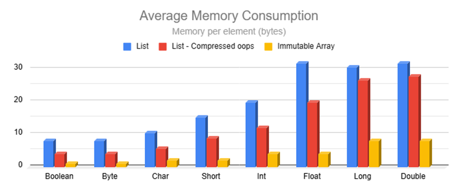

# Immutable Arrays

**Immutable Arrays** offer a safer, faster, and more efficient alternative to lists while maintaining familiar syntax.
They are inline classes that compile to regular arrays but with highly-optimized operations and immutability enforced at
the type level.

Ideal for Android, backend services, and any application seeking enhanced safety, efficiency, or performance.

[![Maven Central][maven-central-badge]][maven-central-url]
[![Licence][license-badge]][license-url]
![Top language][top-language-badge]
![Build Status][build-status-badge]
[![Stargazers][stars-badge]][stars-url]

[Key Benefits](#key-benefits) |
[Quick Start](#quick-start) |
[Performance](#performance) |
[Efficiency](#efficiency) |
[Usage](#usage) |
[Comparison with Alternatives](#comparison-with-alternatives) |
[Caveats](#caveats)

## Key Benefits

* ![Familiar][familiar-shield] Maintains list-like syntax for easy adoption.
* ![Fast][fast-shield] [2 to 8 times faster than lists](BENCHMARKS.md) for most operations.
* ![Efficient][efficient-shield] [Over 4X memory reduction](#memory-efficiency) in many common scenarios.
* ![Immutable][immutable-shield] Cannot be modified, even with casting.
* ![Type Safe][type-safe-shield] Prevents accidental mutation attempts at compile time.
* ![Efficient Builders][efficient-builders-shield] Gather elements more efficiently than
  mutable lists.

If you find this
library useful, please consider giving it a [![GitHub stars][github-stars-shield]][github-url] on [GitHub][github-url]
and sharing it with others.

## Quick Start

![Latest Version][maven-central-shield] available on Maven Central.
See [dependency instructions](../README.md#installation) for more details.

```kotlin
repositories {
    mavenCentral()
}
dependencies {
    implementation("com.danrusu.pods4k:pods4k:<latest_version>")
}
```

Intuitive list-like syntax:

```kotlin
val people = immutableArrayOf(dan, jill, bobby)

// Iterate naturally
for (person in people) {
    sendMarketingEmailTo(person)
}
// All the usual operations
val employedPeople = people.filter { it.isEmployed() }
val salaries = employedPeople.map { it.salary }
```

## Performance

Immutable Arrays typically outperform lists by 2 to 8 times, with some operations even faster. They even outperform
regular arrays in many scenarios, thanks to optimized operations which preserve immutability.

Preview from the [Benchmarks page](BENCHMARKS.md), which includes more benchmarks and explanations:


Smaller data types are split on the right to avoid skewing the axis due to extreme performance.


Elements can be inspected much faster than lists when dealing with the 8 base types:


## Efficiency

Immutability enables re-using instances in many scenarios whereas the same operations on lists create new collections.
Additionally, Immutable Arrays automatically use primitives which further reduces memory consumption, and they're always
perfectly sized, unlike lists that usually have unused capacity.

On average, these optimizations cut memory consumption by over 4 times compared to lists in many common scenarios.

### Zero-memory scenarios

Immutable Arrays intelligently reuse instances to minimize memory:

<details>
<summary>Scenarios that return same instance</summary>

These scenarios return `this` without allocating any memory:

| Operation                         | Returns `this` when                 |
|-----------------------------------|-------------------------------------|
| `take(n)`                         | `n >= size`                         |
| `takeWhile { condition }`         | all elements meet the condition     |
| `takeLast(n)`                     | `n >= size`                         |
| `takeLastWhile { condition }`     | all elements meet the condition     |
| `drop(n)`                         | `n == 0`                            |
| `dropWhile { condition }`         | first element fails condition       |
| `dropLast(n)`                     | `n == 0`                            |
| `dropLastWhile { condition }`     | last element fails condition        |
| `sorted()`                        | `size <= 1`                         |
| `sortedDescending()`              | `size <= 1`                         |
| `sortedBy { selector }`           | `size <= 1`                         |
| `sortedByDescending { selector }` | `size <= 1`                         |
| `sortedWith(comparator)`          | `size <= 1`                         |
| `shuffled()` & `shuffled(random)` | `size <= 1`                         |
| `distinct()`                      | `size <= 1`                         |
| `distinctBy { selector }`         | `size <= 1`                         |
| `plus(otherArray)`                | `otherArray.isEmpty()` & vice versa |

These scenarios allocate memory to track elements, but discard it returning the original instance when all elements are
included:

| Operation                     | Returns `this` when               |
|-------------------------------|-----------------------------------|
| `filter { condition }`        | all elements meet the condition   |
| `filterIndexed { condition }` | all elements meet the condition   |
| `filterNot { condition }`     | all elements fail the condition   |
| `distinct()`                  | all elements are distinct         |
| `distinctBy { selector }`     | selector produces distinct values |

</details>

<details>
<summary>Scenarios that return EMPTY singleton</summary>

These scenarios return the `EMPTY` singleton without allocating any memory:

| Operation                                           | Returns `EMPTY` singleton when      |
|-----------------------------------------------------|-------------------------------------|
| `emptyImmutableArray()` & 8 primitive variants      | always                              |
| `immutableArrayOf()`                                | no arguments provided               |
| `ImmutableArray(n) { init }` & 8 primitive variants | `n == 0`                            |
| `regularArray.toImmutableArray()`                   | `isEmpty()`                         |
| `copyFrom(array, startIndex, size)`                 | `size == 0`                         |
| `take(n)`                                           | `n == 0`                            |
| `takeWhile { condition }`                           | first element fails condition       |
| `takeLast(n)`                                       | `n == 0`                            |
| `takeLastWhile { condition }`                       | last element fails condition        |
| `drop(n)`                                           | `n >= size`                         |
| `dropWhile { condition }`                           | all elements fail condition         |
| `dropLast(n)`                                       | `n >= size`                         |
| `dropLastWhile { condition }`                       | all elements fail condition         |
| `map { selector }`                                  | `isEmpty()`                         |
| `mapIndexed { selector }`                           | `isEmpty()`                         |
| `sorted()`                                          | `isEmpty()`                         |
| `sortedDescending()`                                | `isEmpty()`                         |
| `sortedBy { selector }`                             | `isEmpty()`                         |
| `sortedByDescending { selector }`                   | `isEmpty()`                         |
| `sortedWith(comparator)`                            | `isEmpty()`                         |
| `shuffled()` & `shuffled(random)`                   | `isEmpty()`                         |
| `distinct()`                                        | `isEmpty()`                         |
| `distinctBy { selector }`                           | `isEmpty()`                         |
| `plus(otherArray)`                                  | `isEmpty() && otherArray.isEmpty()` |
| `toTypedImmutableArray()`                           | `isEmpty()`                         |
| `zip(other)`                                        | `isEmpty()` or `other.isEmpty()`    |

These scenarios allocate memory to track elements, but return `EMPTY` singleton when no elements are included:

| Operation                                               | Returns `EMPTY` singleton when    |
|---------------------------------------------------------|-----------------------------------|
| `ImmutableArray.Builder.build()` & 8 primitive variants | `isEmpty()`                       |
| `immutableArrayOfNotNull(...)`                          | all arguments are null            |
| `buildImmutableArray { ... }` & 8 primitive variants    | no elements added                 |
| `iterable.toImmutableArray()`                           | the iterable is empty             |
| `sequence.toImmutableArray()`                           | the sequence is empty             |
| `filter { condition }`                                  | all elements meet the condition   |
| `filterIndexed { condition }`                           | all elements meet the condition   |
| `filterNot { condition }`                               | all elements fail the condition   |
| `filterNotNull()`                                       | all elements are null             |
| `mapNotNull { selector }`                               | all elements are null             |
| `mapIndexedNotNull { selector }`                        | all elements are null             |
| `distinct()`                                            | all elements are distinct         |
| `distinctBy { selector }`                               | selector produces distinct values |
| `flatMap { selector }`                                  | all nested collections are empty  |
| `flatten()`                                             | all nested arrays are empty       |

</details>

### Element Memory Consumption

Immutable Arrays use significantly less memory to store values:



Regular arrays are excluded since their operations typically yield lists, leading to the above memory usage. However,
Immutable Arrays automatically use optimal memory layouts.

<details>
<summary>Memory layout</summary>

Here's an example where we code naturally and automatically benefit from primitives:


Note that the `values` Immutable Array variable directly references a primitive `IntArray` in the generated bytecode.

Immutable Array operations produce Immutable Arrays in order to preserve immutability guarantees. However, most
regular-array operations produce lists resulting in the following memory layout:


Unlike lists or regular arrays, Immutable Arrays also dynamically switch to the most optimal data type:

```kotlin
// ImmmutableArray<Person>
val people = immutableArrayOf(dan, bob, jill)

// ImmutableFloatArray storing primitive floats!
val peopleWeights = people.map { it.weightKg }
```

</details>

The `Average Memory Consumption` chart uses the cache rate of each data type to compute the weighted-average element
size given the cached and uncached sizes:

<details>
<summary>Uncached element size</summary>

Immutable Arrays store primitives whereas lists store references to wrapper objects. Each wrapper incurs extra overhead
from the object header and padding. Combined with the reference to each wrapper, this results in much higher memory
consumption:


</details>

<details>
<summary>Cached element size</summary>

The JVM maintains a small cache of boxed primitive values:

* All `Boolean` and `Byte` values.
* `Char` ASCII values between `0` and `127`.
* `Short`, `Int`, & `Long` values between `-128` and `127`.
* `Float` and `Double` values are never cached.

Storing references to cached wrappers often takes more memory than storing the values directly with Immutable Arrays:


Note that the cache is bypassed when calling the constructor directly (E.g.`java.lang.Boolean(true)`,
`java.lang.Integer(0)`, etc.). This can happen in generic utilities that use reflection to fetch the class by name and
call the constructor making it easy to miss these types of inefficiencies.

</details>

<details>
<summary>Estimated cache rates</summary>

These estimates represent the average percentage of values that use the JVM cache for use-cases that store values in
lists. Lists typically store user data as opposed to all values that we encounter in code. For example, loops are common
and loop counters are usually small, but storing loop counters in lists isn't common.

| Data Type         | Caching Range    | Estimated Cache Rate |
|-------------------|------------------|----------------------|
| Boolean           | `true & false`   | 100%                 |
| Byte              | `-128 to 127`    | 100%                 |
| Char              | ASCII `0 to 127` | 90%                  |
| Short             | `-128 to 127`    | 70%                  |
| Int               | `-128 to 127`    | 50%                  |
| Float             | N/A              | 0%                   |
| Long <sup>1</sup> | `-128 to 127`    | 5%                   |
| Double            | N/A              | 0%                   |

<sup>1</sup> `Long` is chosen when anticipating larger values, such as when storing salaries in cents, but all salaries
are greater than $1.27 making the cache useless in this scenario.

</details>

## Usage

<details>
<summary>Creating Immutable Arrays</summary>

#### Regular Creation

```kotlin
// Empty Arrays
emptyImmutableArray<String>() // generic ImmutableArray<String>
emptyImmutableBooleanArray() // primitive ImmutableBooleanArray
// ...

// From Values
immutableArrayOf("Bob", "Jane") // ImmutableArray<String>
immutableArrayOf(1, 2, 3) // primitive int array
immutableArrayOf<Int>(1, 2, 3) // generic array with boxed integers

// Generated Elements
ImmutableArray(size = 3) { it.toString() } // ["0", "1", "2"]
ImmutableIntArray(size = 5) { it * it } // [0, 1, 4, 9, 16]

// From Existing Collections
listOfStrings.toImmutableArray() // ImmutableArray<String>
listOfIntegers.toImmutableArray() // primitive ImmutableIntArray
listOfIntegers.toImmutableArray<Int>() // generic ImmutableArray<Int>
// similarly with conversions from regular arrays or other iterables like Set, etc.


```

#### With Build Functions

Use build functions for unknown sizes — they're more efficient than collecting elements in a mutable list.

```kotlin
// Creates generic ImmutableArray<Person>
val adults = buildImmutableArray<Person> {
    for (person in people) {
        if (person.age >= 18) add(person)
    }
}

// Creates primitive ImmutableIntArray
val favoriteNumbers = buildImmutableIntArray {
    people.forEach { addAll(it.favoriteNumbers) }
}
```

#### With Builders

Use immutable-array builders when accumulating values in more complex scenarios. They're more efficient than
accumulating values in a mutable list.

```kotlin
fun getTopStocks(): ImmutableArray<Stock> {
    val topStocksBuilder = ImmutableArray.Builder<Stock>()

    addTrendingStocks(topStocksBuilder)
    addFastestGrowingStocks(topStocksBuilder)

    return topStocksBuilder.build()
}

// primitive variants also have builders e.g. ImmutableBooleanArray.Builder()
```

</details>

<details>
<summary>Accessing Elements</summary>

#### By Position

```kotlin
val names = immutableArrayOf("Dan", "Bob", "Jill")

names[0] // "Dan"
val (first, _, third) = names // first = "Dan", third = "Jill"

// Special access methods
names.single() // similarly with singleOrNull()
names.first() // similarly with firstOrNUll()
names.last() // similarly with lastOrNull()
```

#### By Condition

```kotlin
val numbers = immutableArrayOf(1, 4, 5, 6)

val firstEvenNumber = numbers.first { it % 2 == 0 } // 4
val lastOddNumber = numbers.last { it % 2 == 1 } // 5
// similarly with firstOrNull { condition } and lastOrNull { condition }

numbers.single { it % 3 == 0 } // 6
// similarly with singleOrNull
```

</details>

<details>
<summary>Iterating Elements</summary>

```kotlin
val names = immutableArrayOf("Dan", "Bob", "Jill")

// For-Loop
for (name in names) {
    println(name)
}

// ForEach
names.forEach { println(it) }
names.forEachIndexed { index, name -> println("$index: name") }

// Sequence
names.asSequence()
    .filter { /* ... */ }
    .forEach { /* ... */ }

// Iterator
names.asIterable()

val iterator = names.iterator()
while (iterator.hasNext()) {
    //...
}
```

</details>

<details>
<summary>Conditions</summary>

#### Element Conditions

```kotlin
val names = immutableArrayOf("Dan", "Bobby", "Jill")

"Jill" in names // true
names.contains("Joe") // false
names.isEmpty() // false

names.all { it.isNotEmpty() } // true
names.any { it.startsWith("B") } // true
names.none { it.length > 10 } // true
// etc.
```

#### Array Equality Conditions

Structural equality (double `==`) works as expected. Kotlin prevents using `===` (referential equality) because
Immutable Arrays are erased at compile time. Instead, use `referencesSameArrayAs` to check if two instances reference
the same underlying array:

```kotlin
val names = immutableArrayOf("Dan", "Jill")
val sameNames = immutableArrayOf("Dan", "Jill")

// true since they contain identical values
names == sameNames // regular equality

// false since they were created separately 
names.referencesSameArrayAs(sameNames) // referential equality of the array

// Immutability allows us to safely share instances behind the scenes
names.take(100).referencesSameArrayAs(names) // true
names.filter { it.isNotEmpty() }.referencesSameArrayAs(names) // true
// etc.
```

</details>

<details>
<summary>Transformations</summary>

```kotlin
val names = immutableArrayOf("Dan", "Bobby", "Jill")

names.map { it.length } // [3, 5, 4]
names.filter { it.length <= 4 } // ["Dan", "Jill"]
names.take(2) // ["Dan", "Bobby"]
names.sorted() // ["Bobby", "Dan", "Jill"]
names.partition { it.length % 2 == 0 } // Pair(["Jill"], ["Dan", "Bobby"])
// etc.
```

</details>

### Interop with List APIs

Using Immutable Arrays with List-based APIs:

```kotlin
val people = immutableArrayOf(dan, bob, jill)

// copy to standalone read-only List
processData(people.toList())

// create an immutable List wrapper backed by the same array without copying elements
processData(people.asList())

// create an Iterable wrapper without copying the elements
processData(people.asIterable())
```

<details>
<summary>Adding Immutable Arrays to existing projects</summary>

You can transition to Immutable Arrays gradually, without needing to replace all lists at once. This can be tackled at
the class, package, or module level. The boundaries that interact with other parts of the application can expose
Immutable Arrays as regular collections using `toList`, `asList`, or `asIterable`. As adoption progresses, the boundary
layers can be updated to operate on Immutable Arrays directly for optimal efficiency.

Mutable lists that are used for accumulating elements can also be replaced with Immutable Array builders as these
builders are much more efficient.

</details>

<details>
<summary>Choosing between toList(), asList(), and asIterable()</summary>

For reference types, like `ImmutableArray<Person>`, use `asList()` for efficient random access — it wraps the same
backing array without copying it.

For primitive variants, such as `ImmutableFloatArray`, exposing these to list APIs will auto-box elements since lists
use generics:

* When sequential access is sufficient, use `asIterable()` to avoid copying the backing array and encourage single-pass
  processing patterns.
* Otherwise, if random access is needed and the number of accesses won't exceed the list size, use `asList()`.
* For everything else, use `toList()` to auto-box all values upfront and avoid additional auto-boxing when the same
  elements are accessed multiple times.

Using `asList()` or `asIterable()` only auto-boxes the elements that are accessed. For example, wrapping a 1,000-element
array by calling `asList()` and then performing 3 element accesses will only perform 3 auto-boxing operations.

Using `asList()` or `asIterable()` auto-boxes values lazily when accessed. This minimizes garbage collection overhead
for use cases that process the values without retaining the elements, such as when summing their values. Creating
temporary wrapper objects that are immediately discarded is very efficient with modern garbage collectors as the
collection process only copies objects that are still accessible. Having 1 or 1,000 discarded objects has no performance
impact on the collection step. However, if we auto-box all elements up-front to pass to some utility, any collections
that occur before that utility completes would be forced to copy all these objects since they're all still accessible.

</details>

<details>
<summary>Why Immutable Arrays don't implement the List interface</summary>

There are several reasons why Immutable Arrays shouldn't implement the `List` interface:

1. If the 8 primitive variants implemented the List interface, (eg.`ImmutableFloatArray` implemented `List<Float>`),
   elements would be auto-boxed on every access significantly affecting the memory and performance of the library.
2. As a quick test, we made `ImmutableArray<T>` implement the `List<T>` interface and found that the `List` extension
   functions from the Kotlin standard library overshadowed the optimized versions from this library. This significantly
   affects the memory and performance of this library and also breaks the immutability guarantees since the Kotlin
   standard library functions generate read-only lists that can be mutated through casting.
3. The `List` interface contains methods with `List` return types that we wouldn't want users to use. Using these would
   affect the memory and performance, but most importantly, this would make usages accidentally cross over into the list
   world where the immutability guarantees no longer exist. Throwing an `OperationNotSupportedException` would break the
   `List` contract breaking downstream usages in unpredictable ways.

</details>

## Comparison with Alternatives

| Feature                  | Immutable Arrays | Regular Arrays | Read-only Lists    | Unmodifiable Lists | Java Immutable Lists |
|--------------------------|------------------|----------------|--------------------|--------------------|----------------------|
| True Immutability        | ✅                | ❌              | ❌ <sup>1</sup>     | ❌ <sup>2</sup>     | ✅                    |
| Memory Efficiency        | ⭐⭐               | ⭐              | ❌                  | ❌                  | ❌                    |
| Performance              | ⭐⭐               | ⭐              | ❌                  | ❌                  | ❌                    |
| Compile-time Safety      | ✅                | ❌              | ✅ / ❌ <sup>1</sup> | ❌ <sup>3</sup>     | ❌ <sup>3</sup>       |
| Proper equals & hashCode | ✅                | ❌              | ✅                  | ✅                  | ✅                    |
| Meaningful toString()    | ✅                | ❌              | ✅                  | ✅                  | ✅                    |

<sup>1</sup> Casting read-only lists enables mutation

<sup>2</sup> Unmodifiable lists can be modified via the backing list

<sup>3</sup> Immutability in Java APIs is enforced with runtime exceptions

### Benefits over regular arrays

<details>
<summary>✅ Proper equals & hashCode – Supports structural equality</summary>

Unlike regular arrays, Immutable arrays have proper equals & hashCode implementations allowing us to check structural
equality:

```kotlin
immutableArrayOf("Dan", "Bob") == immutableArrayOf("Dan", "Bob") // true

arrayOf("Dan", "Bob") == arrayOf("Dan", "Bob") // false despite identical contents
```

Since we can compare lists directly, developers occasionally attempt to do the same with regular arrays. Even worse,
defects can sneak in without obvious usages of these broken behaviors:

```kotlin
data class Order(val id: Long, private val products: Array<Product>)

val rejectedOrders = mutableSetOf<Order>()
// Oops, attempting to add Orders to a hashSet will make use of the auto-generated 
// equals & hashCode methods from the Order data class which will in turn rely on 
// the defective equals & hashCode implementation of regular arrays
```

Swapping `Array<Product>` with `ImmutableArray<Product>` will fix this defect scenario.

</details>

<details>
<summary>✅ Safe asList() – No backdoor mutations</summary>

The `asList()` function is typically used to efficiently share regular arrays with APIs that operate on lists since this
creates a view wrapper that shares the same backing array without copying the elements. However, casting the wrapper
exposes a backdoor for mutating the original array:

```kotlin
val array = arrayOf("Dan", "Jill")
val list = namesArray.asList()

(list as MutableList<String>)[0] = "Bob"
array[0] // "Bob"!!!
```

Unlike regular arrays, calling `asList()` on an Immutable Array is safe as that returns a truly-immutable view backed by
the same array.

</details>

<details>
<summary>✅ Readable toString()</summary>

Unlike regular arrays, Immutable Arrays provide a readable `toString()` output:

```kotlin
println(immutableArrayOf("Dan", "Bob")) // [Dan, Bob]  Nice!

println(arrayOf("Dan", "Bob")) // [Ljava.lang.String;@7d4991ad  Yuck!
```

</details>

<details>
<summary>✅ Optimized Performance – Operations run faster and use less memory</summary>

Regular arrays are often used for memory and performance benefits, but many operations produce lists, negating those
benefits and adding auto-boxing overhead.

```kotlin
val weights = doubleArrayOf(1.5, 3.0, 10.2, 15.7, 2.0)
val largeWeights = weights.filter { it > 10.0 }
// Oops, this creates a List<Double> auto-boxing each value!
```

Unlike regular arrays, Immutable Arrays have specializations resulting in the most optimal representation so that clean
code is efficient by default:

```kotlin
val people = immutableArrayOf(
    Person(name = "Dan", age = 3),
    Person(name = "Bob", age = 4),
) // ImmutableArray<Person>

// Since the age field is a non-nullable Int, Mapping the ages uses an 
// efficient ImmutableIntArray storing primitive int values
val ages = people.map { it.age }
```

Here's a non-exhaustive list of operations that take advantage of primitives resulting in significant memory and
performance improvements over regular arrays:

* drop
* dropLast
* dropLastWhile
* dropWhile
* filter
* filterIndexed
* filterNot
* filterNotNull
* flatMap
* flatMapIndexed
* flatten
* map
* mapNotNull
* mapIndexed
* mapIndexedNotNull
* partition
* sorted
* sortedBy
* sortedByDescending
* sortedDescending
* sortedWith
* take
* takeLast
* takeLastWhile
* takeWhile
* etc.

</details>

<details>
<summary>✅ Efficient sharing of encapsulated data</summary>

Regular arrays can have their elements reassigned making them a poor choice for encapsulated data that needs to be
shared. The only safe solution is to duplicate the contents before sharing so that callers can't mutate the encapsulated
array. Note that calling `asList()` on a generic array is not safe as the generated view can be cast into a
`MutableList` exposing a backdoor for mutating the original array. Additionally, calling `asList()` on a primitive
array, like `IntArray`, negatively affects memory and performance by auto-boxing elements every time they're accessed.

Immutable arrays can be safely shared resulting in cleaner and more efficient code.
</details>

### Benefits over read-only lists

<details>
<summary>✅ Casting doesn't introduce backdoor for mutation</summary>

Despite appearances, read-only lists can be modified through casting to `MutableList`:

```kotlin
val values = listOf(1, 2, 3)
(values as MutableList)[0] = 100 // backdoor to mutation
println(values) // [100, 2, 3]
```

Immutable arrays don't have this backdoor:

```kotlin
val values = immutableArrayOf(1, 2, 3)
values[0] = 100 // Compiler error: No set method providing array access

@Suppress("CAST_NEVER_SUCCEEDS")
(values as IntArray)[0] = 100
// ClassCastException: ImmutableIntArray cannot be cast to [I
```

</details>

<details>
<summary>✅ More memory efficient</summary>

Immutable Arrays reduce memory consumption by over 4X compared to lists in most scenarios. See
the [Memory Efficiency](#memory-efficiency) comparison for details.

</details>

<details>
<summary>✅ Higher performance</summary>

Immutable Arrays are between 2 - 8X faster than lists for most operations. See the [Benchmark page](BENCHMARKS.md) for
details.

</details>

### Benefits over unmodifiable lists

<details>
<summary>✅ Avoids delayed-processing defects</summary>

Calling `Collections.unmodifiableList(myMutableList)` doesn't create a new immutable list — it simply wraps the
original, which remains mutable. Although the view won't allow mutation, the underlying collection that the view
references can be mutated. This introduces a category of defects where a view is shared and intended to be processed
right away but the underlying list is modified again before the view is processed. This can happen when the view is
shared and then a separate thread mutates the underlying list. Another scenario is when the handling logic gets updated
to delay the processing to a later time by introducing a worker queue.

Immutable arrays don't have this problem as they can never be mutated.

</details>

<details>
<summary>✅ No mutation exceptions at runtime</summary>

Unmodifiable lists implement the Java `List` interface and override mutating methods to throw exceptions. Although
mutation is prevented at the view level, bad usages result in runtime exceptions affecting the user experience.

Immutable Arrays prevent mutation at compile time, eliminating this entire class of defects.

</details>

<details>
<summary>✅ More memory efficient</summary>

Unmodifiable lists have the same memory drawbacks as read-only lists
(see [Benefits over read-only lists](#benefits-over-read-only-lists)) along with a tiny extra overhead from the wrapper.

</details>

<details>
<summary>✅ Higher performance</summary>

Unmodifiable lists have similar performance drawbacks as read-only lists (
see [Benefits over read-only lists](#benefits-over-read-only-lists)) but slightly worse due to the extra layer of
indirection caused by the view wrapper.

</details>

### Benefits over Java immutable lists

<details>
<summary>✅ No mutation exceptions at runtime</summary>

Java-based immutable lists, like Guava's, extend the Java `List` interface but rely on runtime exceptions to prevent
modifications. Although this prevents mutation, bad usages result in runtime exceptions affecting the user experience.

Attempting to mutate an immutable array won't even compile preventing this category of defects altogether.

</details>

<details>
<summary>✅ More memory efficient</summary>

Immutable lists have the same memory drawbacks as read-only lists
(see [Benefits over read-only lists](#benefits-over-read-only-lists))

</details>

<details>
<summary>✅ Higher performance</summary>

Immutable lists have the same performance drawbacks as read-only lists
(see [Benefits over read-only lists](#benefits-over-read-only-lists)).

</details>

## Caveats

<details>
<summary>Shallow immutability</summary>

Immutable Arrays are shallowly immutable – you can’t modify the array itself, but the elements inside may still be
mutable:

```kotlin
val people = immutableArrayOf(Person("Bob"), Person("Jane"))

people[0].spouse = Person("Jill")
```

This is typical behavior for immutable collections across programming languages.

</details>

<details>
<summary>No identity</summary>

Immutable Arrays are zero-cost abstractions, eliminated at compile time as they compile to regular arrays. We can think
of them as a kind of virtual quantum particle that comes in and out of existence (see Auto-boxing below).

Since inline classes are compile-time abstractions rather than persistent wrapper objects, Immutable Arrays don't
support direct identity-based operations.

#### Reference equality:

```kotlin
// Note the triple === referential equality.
immutableArray1 === immutableArray2 // Compiler error: Identity equality is forbidden
```

Regular structural equality using `==` is allowed and works as expected.

Use `immutableArray1.referencesSameArrayAs(immutableArray2)` to check whether two Immutable Arrays reference the same
underlying array.

#### Identity hashCode:

```kotlin
val values = immutableArrayOf(1, 2, 3)
val identityHashCode = System.identityHashCode(values)
// Oops, identityHashCode accepts Any type instead of an immutable array type, so it's auto-boxed 
// and the identity hashCode of that temporary wrapper is returned which is meaningless
```

#### Synchronization:

```kotlin
class Account(val accountHolders: ImmutableArray<Person>) {
    fun withdraw(amount: Money) {
        // Compiler warning: Synchronizing by ImmutableArray<Person> is forbidden
        synchronized(accountHolders) {
            // Oops, synchronized accepts Any type instead of an immutable array type, so it's 
            // auto-boxed.  We're meaninglessly synchronizing on that temporary wrapper
            balance -= amount
        }
    }
}
```

</details>

<details>
<summary>Auto-boxing</summary>

Immutable arrays are zero-cost abstractions that get eliminated at compile time so the code operates on the underlying
array directly.

When an Immutable Array is used as a generic type or supertype (like Any), the Kotlin compiler inserts auto-boxing
instructions. In these scenarios, the Immutable Array is auto-boxed into a single tiny wrapper object, but note that
this auto-boxing is different from lists as lists auto-box each primitive element whereas Immutable Arrays leaves the
primitive elements as is and only a single tiny wrapper is created for the array itself.

Normally auto-boxing can have a large memory or performance impact when storing many primitives in lists. However, the
overhead of auto-boxing an Immutable Array is identical to that of autoboxing a single primitive `Double`. So the memory
and performance overhead of this operation is negligible in most scenarios unless it's part of a tight inner loop.

Explicitly specifying Immutable Array types for variables, properties, function parameters, receivers, or return types
avoids auto-boxing. Auto-boxing is also avoided for inline functions which inline the generic parameter that references
an Immutable Array. For example using `with(immutableArray) { ... }` avoids auto-boxing because `with` is inlined into
each call site replacing the generic type with the actual Immutable Array type.

Here are some examples to get a better idea of where auto-boxing occurs:

```kotlin
// no auto-boxing.  `names` references the underlying array directly
val names = immutableArrayOf("Dan", "Bob")

// no auto-boxing because `with` is an inline function so the generic parameter gets replaced at compile time
with(names) {
    println(this.size)
}

// casting induces auto-boxing.  This prevents any backdoor to the underlying array 
names as Any

// auto-boxing since println accepts a variable of type Any
println(names)

// Avoid println auto-boxing by calling toString() explicitly but the benefit is negligible if it's not in a loop
println(names.toString()) // no auto-boxing since we're not passing the immutable array itself

// Even though we're explicitly specifying the ImmutableArray type as the generic type, the ArrayList 
// class itself isn't hardcoded to work with Immutable Arrays, so each immutable array must be auto-boxed
val arrays = ArrayList<ImmutableArray<String>>()
arrays += names // auto-boxing due to generics

// auto-boxing because the immutable array is used as a generic receiver
names.genericExtensionFunction()

fun <T> T.genericExtensionFunction() {
    // ...
}
```

When using reflection to traverse the object graph, reflective code will encounter the underlying array directly except
for the auto-boxing scenarios, in which case it will encounter the tiny wrapper.

For optimal performance, we recommend explicitly using the immutable array types for everything that expects to work
with Immutable arrays as this avoids auto-boxing. Passing Immutable Arrays to generic inline functions avoids
auto-boxing, as the generic parameter is replaced at compile time.

</details>

<details>
<summary>Experimental Kotlin features</summary>

This library leverages the following experimental Kotlin features that may evolve in future Kotlin releases:

* [Overload resolution by lambda return type](https://kotlinlang.org/api/latest/jvm/stdlib/kotlin/-overload-resolution-by-lambda-return-type/)
    * This enables multiple overloaded functions that only differ in the lambda return type. This enables optimized
      specializations that auto-bind to the most optimal return type. Eg. `people.map { it.weightKg }` returns an
      `ImmutableFloatArray` when `weightKg` is a float.
    * This feature was introduced in Kotlin 1.4 and is used extensively throughout the Kotlin standard library.
* [Custom equals in value classes](https://youtrack.jetbrains.com/issue/KT-24874/Support-custom-equals-and-hashCode-for-value-classes)
    * This enables overriding the `equals` & `hashCode` methods for inline value classes.
    * This was added for the JVM IR backend (which handles both Android & regular backend JVM development) in Kotlin 1.9
      but hasn't been announced yet because the other multiplatform backends were not ready.
    * Vote and comment on this [YouTrack ticket](https://youtrack.jetbrains.com/issue/KT-24874) to raise the importance
      of this feature so that Immutable Arrays can eventually support Kotlin multiplatform.

</details>

[maven-central-badge]: https://img.shields.io/maven-central/v/com.danrusu.pods4k/pods4k?style=for-the-badge

[license-badge]: https://img.shields.io/github/license/daniel-rusu/pods4k?style=for-the-badge

[top-language-badge]: https://img.shields.io/github/languages/top/daniel-rusu/pods4k?style=for-the-badge

[build-status-badge]: https://img.shields.io/github/actions/workflow/status/daniel-rusu/pods4k/ci.yml?style=for-the-badge&label=CI


[stars-badge]: https://img.shields.io/github/stars/daniel-rusu/pods4k?style=for-the-badge


[familiar-shield]: https://img.shields.io/badge/Clean_%26_Familiar-blue

[fast-shield]: https://img.shields.io/badge/Blazing_Fast-blue

[efficient-shield]: https://img.shields.io/badge/Memory_Efficient-blue

[immutable-shield]: https://img.shields.io/badge/True_Immutability-blue

[type-safe-shield]: https://img.shields.io/badge/Type_Safety-blue

[efficient-builders-shield]: https://img.shields.io/badge/Efficient_Builders-blue

[github-stars-shield]: https://img.shields.io/github/stars/daniel-rusu/pods4k?label=Star

[maven-central-shield]: https://img.shields.io/maven-central/v/com.danrusu.pods4k/pods4k?label=Latest%20Version


[github-url]: https://github.com/daniel-rusu/pods4k

[stars-url]: https://github.com/daniel-rusu/pods4k/stargazers

[maven-central-url]: https://central.sonatype.com/artifact/com.danrusu.pods4k/pods4k

[license-url]: https://github.com/daniel-rusu/pods4k/blob/main/LICENSE
