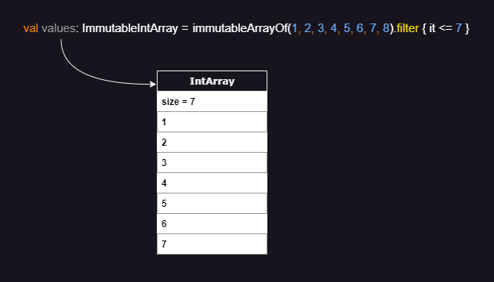
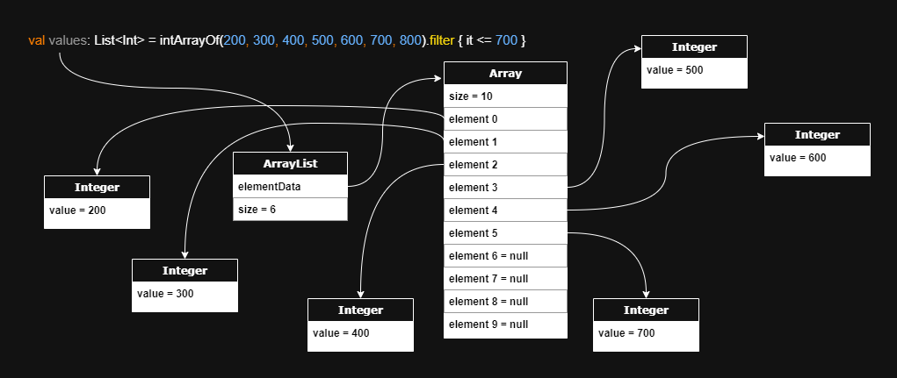

# Immutable Arrays

Immutable Arrays offer a safer and more efficient alternative to read-only lists, combining the safety of true
immutability with the performance of primitive arrays while maintaining the same look and feel of using lists. Immutable
arrays are inline classes that compile to specialized arrays in the generated bytecode while eliminating mutating
capabilities and introducing hundreds of optimized specializations.

If you find this library useful, please consider giving it
a [](https://github.com/daniel-rusu/pods4k)
on [GitHub](https://github.com/daniel-rusu/pods4k) and sharing it with others.

* [Key Benefits](#key-benefits)
* [Usage](#usage)
* [Benefits vs Alternatives](#benefits-vs-alternatives)
* [Memory Layout](#memory-layout)
* [Caveats](#caveats)

## Key Benefits

* **Clean & Readable**
    * Usages look the same as lists for most operations making it an easy transition with clean code.
* **True Immutability**
    * Unlike read-only lists, Immutable Arrays cannot be mutated through casting.
* **Memory Efficiency**
    * Up to 32 times less memory than lists!
* **Performance**
    * Up to 12 times faster than lists!
* **Type Safety**
    * Prevents mutation attempts at compile time.

Whether you're dealing with memory-constrained environments, performance-sensitive workloads, or simply want the added
integrity of true immutability, Immutable Arrays are a great addition to any Android or JVM backend server applications.

## Usage

See [dependency instructions](../README.md#dependency) for adding this library to your gradle or maven build.

Usages look the same as regular lists after construction:

```kotlin
val people = immutableArrayOf(dan, jill, bobby) // ImmutableArray<Person>

people[0] // dan

// Normal iteration with loops, forEach, asSequence, etc.
for (person in people) {
    sendMarketingEmail(person)
}

// All the typical transformations and conditions
val adults = people.filter { it.age >= 18 } // ImmutableArray<Person>
val adultAges = adults.map { it.age } // ImmutableIntArray

val containsRetirees = adults.any { it.isRetired() }
val adultsSortedByName = adults.sortedBy { it.name } // ImmutableArray<Person>

// Working toString()
println(adults)

// Working equals & hashCode
if (adults == immutableArrayOf(dan, jill)) {
    //...
}

// etc.
```

<details>
<summary>Creating Immutable Arrays</summary>

### Empty Arrays

```kotlin
emptyImmutableArray<String>() // generic ImmutableArray<String>
emptyImmutableBooleanArray() // primitive ImmutableBooleanArray
emptyImmutableFloatArray() // primitive ImmutableFloatArray
// ...
```

### From Values

```kotlin
immutableArrayOf("Bob", "Jane") // ImmutableArray<String>
immutableArrayOf(1, 2, 3) // primitive int array
immutableArrayOf<Int>(1, 2, 3) // generic array with boxed integers
```

### Generated Elements

```kotlin
ImmutableArray(size = 3) { it.toString() } // ["0", "1", "2"]
ImmutableIntArray(size = 5) { it * it } // [0, 1, 4, 9, 16]
ImmutableBooleanArray(size = 3) { it % 2 == 0 } // [true, false, true]
```

### From Existing Structures

```kotlin

listOfStrings.toImmutableArray() // ImmutableArray<String>
listOfIntegers.toImmutableArray() // primitive ImmutableIntArray
listOfIntegers.toImmutableArray<Int>() // generic ImmutableArray<Int>

// similarly with conversions from regular arrays or other iterables like Set, etc.
```

### With Build Functions

We can use the build functions when we don't know the resulting size in advance:

```kotlin
// Creates generic ImmutableArray<Person>
val adults = buildImmutableArray<Person> {
    for (person in people) {
        if (person.age >= 18) add(person)
    }
}

// Creates primitive ImmutableIntArray
val favoriteNumbers = buildImmutableIntArray {
    people.forEach { addAll(it.favoriteNumbers) }
}
```

Build functions are more efficient than accumulating the values in a collection and converting it to an immutable array.

### With Builders

We can use immutable-array builders when accumulating values in more complex scenarios:

```kotlin
fun getTopStocks(): ImmutableArray<Stock> {
    val topStocksBuilder = ImmutableArray.Builder<Stock>()

    addTrendingStocks(topStocksBuilder)
    addFastestGrowingStocks(topStocksBuilder)

    return topStocksBuilder.build()
}

fun addTrendingStocks(builder: ImmutableArray.Builder<Stock>) {
    fetchInterestingStocks().forEach { if (it.trendingScore > 80) builder.add(it) }
}

// primitive variants also have builders e.g. ImmutableBooleanArray.Builder()
```

Builders are more efficient than accumulating the values in a collection and converting that into an immutable array.

</details>

<details>
<summary>Accessing Elements</summary>

### By Position

```kotlin
val names = immutableArrayOf("Dan", "Bob", "Jill")

// By index
names[0]
names.get(1)

// By destructuring
val (first, _, third) = names

// Special access methods
names.single() // & singleOrNull()
names.first() // & firstOrNUll()
names.last() // & lastOrNull()
```

### By Condition

```kotlin
val numbers = immutableArrayOf(1, 4, 5, 6)

val firstEvenNumber = numbers.first { it % 2 == 0 } // 4
val lastOddNumber = numbers.last { it % 2 == 1 } // 5
// similarly with firstOrNull & lastOrNull

numbers.single { it % 3 == 0 } // 6
// similarly with singleOrNull
```

</details>

<details>
<summary>Iterating Elements</summary>

```kotlin
val names = immutableArrayOf("Dan", "Bob", "Jill")

for (name in names) {
    println(name)
}

names.forEach { println(it) }

names.forEachIndexed { index, name ->
    println("$index: name")
}

// Sequences
names.asSequence()
    .filter { /* ... */ }
    .map { /* ... */ }
    .forEach { /* ... */ }
```

</details>

<details>
<summary>Conditions</summary>

```kotlin
val names = immutableArrayOf("Dan", "Bobby", "Jill")

"Jill" in names // true

names.isEmpty() // false

names.all { it.isNotEmpty() } // true

names.any { it.startsWith("B") } // true

names.none { it.length > 10 } // true

names.contains("Joe") // false

// etc.
```

</details>

<details>
<summary>Transformations</summary>

```kotlin
val names = immutableArrayOf("Dan", "Bobby", "Jill")

names.map { it.length } // [3, 5, 4]

names.filter { it.length <= 4 } // ["Dan", "Jill"]

names.take(2) // ["Dan", "Bobby"]

names.sorted() // ["Bobby", "Dan", "Jill"]

names.partition { it.length % 2 == 0 } // Pair(["Jill"], ["Dan", "Bobby"])

names + "Jane" // ["Dan", "Bobby", "Jill", "Jane"]

// etc.
```

</details>

## Benefits vs Alternatives

Here's a quick overview of how immutable arrays compare to alternatives:

| Feature                  | Immutable Arrays | Regular Arrays         | Read-only Lists                      | Unmodifiable Lists          | Immutable Lists           |
|--------------------------|------------------|------------------------|--------------------------------------|-----------------------------|---------------------------|
| True Immutability        | ✅                | ❌                      | ❌ <br/>Casting enables mutation      | ❌ <br/>Mutable backing list | ✅                         |
| Memory Efficiency        | ✅✅               | ✅                      | ❌                                    | ❌                           | ❌                         |
| Performance              | ✅✅               | ✅                      | ❌                                    | ❌                           | ❌                         |
| Compile-time Safety      | ✅                | ❌ <br/> Can be mutated | ✅ / ❌ <br/> Casting enables mutation | ❌ <br/> Throws exceptions   | ❌ <br/> Throws exceptions |
| Proper equals & hashCode | ✅                | ❌                      | ✅                                    | ✅                           | ✅                         |
| Meaningful toString()    | ✅                | ❌                      | ✅                                    | ✅                           | ✅                         |

### Benefits over regular arrays

<details>
<summary>Meaningful toString()</summary>

Unlike regular arrays, calling toString() on immutable arrays produces a pretty representation of the data:

```kotlin
println(immutableArrayOf("Dan", "Bob")) // [Dan, Bob]  Nice!

println(arrayOf("Dan", "Bob")) // [Ljava.lang.String;@7d4991ad  Yuck!
```

</details>

<details>
<summary>Efficient sharing of encapsulated data</summary>

Regular arrays can have their elements reassigned making them a poor choice for encapsulated data that needs to be
shared. Using a regular array forces us to duplicate the contents before sharing so that callers can't mutate the
encapsulated array. Note that calling `asList()` to wrap the array is not safe as casting that to an ArrayList exposes a
backdoor to mutating the shared underlying array.

Duplicating the contents negatively affects performance and adds extra pressure on the garbage collector. Immutable
arrays can be safely shared resulting in cleaner and more efficient code.
</details>

<details>
<summary>Efficient operations</summary>

Regular arrays are usually chosen for memory or performance reasons, however these benefits are negated when performing
dozens of typical operations:

```kotlin
val weights = doubleArrayOf(1.5, 3.0, 10.2, 15.7, 2.0)
val largeWeights = weights.filter { it > 10.0 }
// Oops, this creates a List<Double> auto-boxing each value!
```

Unlike regular arrays, most of the common operations on immutable arrays have specializations so that clean code is
efficient by default:

```kotlin
val people = immutableArrayOf(
    Person(name = "Dan", age = 3),
    Person(name = "Bob", age = 4),
) // ImmutableArray<Person>

// Since the age field is a non-nullable Int, Mapping the ages uses an 
// efficient ImmutableIntArray storing primitive int values
val ages = people.map { it.age }
performStatisticalAnalysis(ages)
```

Here's a non-exhaustive list of operations that take advantage of primitives resulting in significant memory and
performance improvements over regular arrays:

* map
* mapNotNull
* mapIndexed
* mapIndexedNotNull
* flatMap
* flatMapIndexed
* flatten
* filter
* filterIndexed
* filterNot
* filterNotNull
* take
* takeWhile
* takeLast
* takeLastWhile
* drop
* dropWhile
* dropLast
* dropLastWhile
* sorted
* sortedWith
* sortedBy
* sortedDescending
* sortedByDescending
* partition
* etc.

</details>

<details>
<summary>Avoids equality & hashCode defects</summary>

Unlike regular arrays, Immutable arrays have proper equals & hashCode implementations allowing us to compare them in
the same way that we compare lists:

```kotlin
arrayOf("Dan", "Bob") == arrayOf("Dan", "Bob") // false!

// Yes, this condition will be true when immutable arrays have equal contents
immutableArrayOf("Dan", "Bob") == immutableArrayOf("Dan", "Bob") // true
```

Since we can compare lists directly, developers occasionally attempt to do the same with regular arrays. Even worse,
defects can sneak in without obvious usages of these broken behaviors:

```kotlin
data class Order(val id: Long, private val products: Array<Product>)

val rejectedOrders = mutableSetOf<Order>()
// Oops, attempting to add Orders to a hashSet will make use of the auto-generated 
// equals & hashCode methods from the Order data class which will in turn rely on 
// the defective equals & hashCode implementation of regular arrays
```

Swapping `Array<Product>` with `ImmutableArray<Product>` will avoid this defect scenario and work correctly.

</details>

<br>

### Benefits over read-only lists

<details>
<summary>Casting doesn't introduce backdoor for mutation</summary>

Read-only lists appear to be immutable at first as they don't expose any mutating methods. However, they can be cast
into a `MutableList` and modified:

```kotlin
val values = listOf(1, 2, 3)
values[0] = 2 // Compiler error: No set method providing array access

(values as MutableList)[0] = 100 // backdoor to mutation
println(values) // [100, 2, 3]
```

Immutable arrays don't have this backdoor:

```kotlin
val values = immutableArrayOf(1, 2, 3)
values[0] = 2 // Compiler error: No set method providing array access

@Suppress("CAST_NEVER_SUCCEEDS")
(values as IntArray)[0] = 100
// ClassCastException: ImmutableIntArray cannot be cast to [I
```

</details>

<details>
<summary>More memory efficient</summary>

Read-only lists use between 3 to 32 times more memory than immutable arrays when storing or performing operations that
produce primitive values (E.g. `people.map { it.age }`). See the **Memory Impacts** section
in [Memory Layout](#memory-layout) for details.

Read-only lists also have 17% unused capacity on average when the resulting size isn't known in advance. There's also
the small memory overhead of the `ArrayList` class whereas variables of immutable array types point directly at the
backing array in the generated bytecode.

</details>

<details>
<summary>Higher performance</summary>

Most operations are significantly faster on immutable arrays compared to lists. Operations on immutable arrays have been
optimized to reduce memory footprint, improve cache locality, and reduce the number of memory hops. See
the `Performance Impacts` section in [Memory Layout](#memory-layout) for details.

</details>

<br>

### Benefits over unmodifiable lists

<details>
<summary>Safer and more robust</summary>

Calling `Collections.unmodifiableList(myMutableList)` doesn't copy the elements into a new immutable list but rather
creates a view that wraps the original collection. Although the view won't allow mutation, the underlying collection
that the view references can continue to be mutated. This introduces a category of defects where a view is shared and
intended to be processed right away but the underlying mutable list is modified again before the view is processed. This
can happen when the view is shared and then a separate thread mutates the underlying list. Another scenario is when the
processing logic gets updated to delay the processing to a later time such as by adding it to some processing queue.

Immutable arrays don't have this problem as they can never be mutated by anyone.

</details>

<details>
<summary>No mutation exceptions at runtime</summary>

Unmodifiable lists implement the Java `List` interface and override mutating methods to throw exceptions. Although
mutation is prevented at the view level, bad usages result in runtime exceptions affecting the user experience.

Attempting to mutate an immutable array won't even compile preventing this category of defects altogether.

</details>

<details>
<summary>More memory efficient</summary>

Unmodifiable lists have the same memory drawbacks as read-only lists
(see [Benefits over read-only lists](#benefits-over-read-only-lists)) along with a tiny extra overhead from the wrapper.

</details>

<details>
<summary>Higher performance</summary>

Unmodifiable lists have similar performance drawbacks as read-only lists
(see [Benefits over read-only lists](#benefits-over-read-only-lists)) but slightly worse due to the extra layer of
indirection caused by the view wrapper.

</details>

<br>

### Benefits over immutable lists

<details>
<summary>No mutation exceptions at runtime</summary>

Immutable lists implement the Java `List` interface and override mutating methods to throw exceptions. Although this
prevents mutation, bad usages result in runtime exceptions affecting the user experience.

Attempting to mutate an immutable array won't even compile preventing this category of defects altogether.

</details>

<details>
<summary>More memory efficient</summary>

Immutable lists use between 3 to 32 times more memory than immutable arrays when storing or performing operations that
produce primitive values (E.g. `people.map { it.age }`). See the **Memory Impacts** section
in [Memory Layout](#memory-layout) for details.

There's also the small memory overhead of the immutable list class whereas variables of immutable array types point
directly at the backing array in the generated bytecode.

</details>

<details>
<summary>Higher performance</summary>

Immutable lists have the same performance drawbacks as read-only lists
(see [Benefits over read-only lists](#benefits-over-read-only-lists)).

</details>

## Memory Layout

Performing some operation that results in an `ImmutableIntArray` ends up with the following memory layout:



Note that the `values` variable of type `ImmutableIntArray` actually references a regular primitive int array in the
bytecode.

Here is the same example but operating on a regular primitive array and ending up with a read-only list:



Classes that operate on generics, such as lists, can't store primitive types directly. Each primitive int gets
auto-boxed into an `Integer` wrapper object and a pointer to that wrapper is passed to the resulting list. These wrapper
objects are allocated in different regions of memory depending on availability and the garbage collector also
periodically moves surviving objects around, so we can end up with the objects scattered throughout the heap.

<details>
<summary>Memory Impacts</summary>

1. Notice that the list contains 7 values but the backing array has a capacity of 10. When an `ArrayList` runs out of
   capacity, the backing array is replaced with a new array that's 1.5-times larger and the elements get copied over. On
   average, array lists end up with about 17% of unused capacity when the exact capacity isn't specified ahead of time.

2. A primitive int uses just 4 bytes. However, an `Integer` wrapper object requires 16 bytes for the object header, plus
   4 bytes for the int value, plus another 4 bytes of padding totaling 24 bytes. Enabling JVM pointer compression
   reduces this to 16 bytes per wrapper.

3. Lists don't store the wrappers directly but instead store pointers to each of these wrappers. A list of integers uses
   8 + 24 = 32 bytes to store each 4-byte int value!  Enabling JVM pointer compression reduces this to 20 bytes per
   integer element but that's still 5X the memory of primitive int arrays!

4. The ratio becomes worse when storing smaller data types. E.g. A list of booleans uses 32X more memory than primitive
   boolean arrays when JVM pointer compression isn't enabled and 20X more memory with pointer compression.

The following table shows the per-element memory usage on a 64-bit JVM accounting for the size of the element pointer,
wrapper object header, value, and padding in the wrapper object to account for memory alignment:

| Type    | Immutable Array<br/>(bytes per element) | ArrayList<br/>(bytes per element) | ArrayList on JVM with compressed oops<br/>(bytes per element) |
|---------|-----------------------------------------|-----------------------------------|---------------------------------------------------------------|
| Boolean | **1**                                   | 8 + (16 + 1 + 7) = **32**         | 4 + (12 + 1 + 3) = **20**                                     |
| Byte    | **1**                                   | 8 + (16 + 1 + 7) = **32**         | 4 + (12 + 1 + 3) = **20**                                     |
| Char    | **2**                                   | 8 + (16 + 2 + 6) = **32**         | 4 + (12 + 2 + 2) = **20**                                     |
| Short   | **2**                                   | 8 + (16 + 2 + 6) = **32**         | 4 + (12 + 2 + 2) = **20**                                     |
| Int     | **4**                                   | 8 + (16 + 4 + 4) = **32**         | 4 + (12 + 4 + 0) = **20**                                     |
| Float   | **4**                                   | 8 + (16 + 4 + 4) = **32**         | 4 + (12 + 4 + 0) = **20**                                     |
| Long    | **8**                                   | 8 + (16 + 8 + 0) = **32**         | 4 + (12 + 8 + 4) = **28**                                     |
| Double  | **8**                                   | 8 + (16 + 8 + 0) = **32**         | 4 + (12 + 8 + 4) = **28**                                     |

</details>

<details>
<summary>Performance Impacts</summary>

Fetching from main memory can take hundreds of cycles on modern CPU architectures. The CPU tries to minimize latency by
fetching in bulk and also by predicting and pre-fetching data before it's requested. Primitive arrays store values in a
contiguous block of memory, so the CPU will prefetch neighboring elements making subsequent accesses essentially free
when iterating. However, the CPU pre-fetcher has a tough time predicting the location of scattered memory when dealing
with lists of wrapper objects, resulting in much higher memory latency on average.

To get an idea of the potential performance impact of wrapper objects, Java Language Architect, Brian Goetz, ran some
benchmarks replacing reference carriers with values as part of project Valhalla exploration. Brian found performance
improvements ranging from 3.5x to 12x faster: [YouTube presentation](https://youtu.be/1H4vmT-Va4o?t=899)

</details>

## Caveats

<details>
<summary>Relies on experimental Kotlin features</summary>

The following experimental features are used which could change in future Kotlin releases:

* [Inline value classes](https://kotlinlang.org/docs/inline-classes.html)
    * These enable zero cost abstractions that are eliminated at compile time. The immutable array classes are inline
      value classes.
    * This feature was introduced in Kotlin 1.3 and is used by some standard library features
      like [unsigned integer types](https://kotlinlang.org/docs/unsigned-integer-types.html).
* [Overload resolution by lambda return type](https://kotlinlang.org/api/latest/jvm/stdlib/kotlin/-overload-resolution-by-lambda-return-type/)
    * This enables the hundreds of optimized specializations that make use of overloaded functions containing parameters
      with different lambda return types. Without this feature, these overloaded functions would result in a runtime
      signature clash on the JVM.
    * This feature was introduced in Kotlin 1.4 and is used extensively throughout the Kotlin standard library.
* [Custom equals in value classes](https://youtrack.jetbrains.com/issue/KT-24874/Support-custom-equals-and-hashCode-for-value-classes)
    * This enables overriding the equals & hashcode methods for inline value classes.
    * This feature was added for the JVM IR backend (which handles both Android & regular backend JVM development) in
      Kotlin 1.9 but hasn't been announced yet because the other backends were not ready. Since this isn't a Kotlin
      multiplatform library, the lack of support in the other backends won't affect us.

</details>

<details>
<summary>Shallow immutability</summary>

Similar to immutable lists, immutable arrays only prevent mutation of the direct contents so that elements cannot be
added, removed, or replaced. However, the elements themselves can still be mutated if they expose mutating capabilities:

```kotlin
class Person(val name: String, var spouse: Person? = null)

val people = immutableArrayOf(
    Person("Bob"),
    Person("Jane"),
)

// The `people` immutable array is protected against mutation
people[0] = Person("Dan") // Compile error: No set method providing array access

// However, a `Person` instance can be mutated since it exposes `spouse` as a var property 
people[0].spouse = Person("Jill")
```

</details>

<details>
<summary>Auto-boxing</summary>

Immutable arrays are zero-cost abstractions that get eliminated at compile time. All variables, properties, function
arguments, function receiver types, or return types that explicitly use the immutable array types get replaced
at compile time to operate directly on the underlying array without any auto-boxing or wrapper object.

The Kotlin compiler adds additional instructions everywhere the immutable array is interpreted as a generic type, or by
a supertype like `Any` or `Any?`. In these scenarios, the immutable array is auto-boxed into a single tiny wrapper
object which stores a reference to the actual array. However, generic functions that are marked with the `inline`
modifier, such as `with` from the Kotlin standard library, don't induce auto-boxing because the function is inlined into
each call site replacing the generic with the actual type.

Note that when using reflection to traverse the object graph, reflective code will encounter the underlying array
directly except for the auto-boxing scenarios, in which case it will encounter the wrapper object.

Here are some examples to get a better idea of where auto-boxing occurs:

```kotlin
// no auto-boxing.  `names` references the underlying array directly
val names = immutableArrayOf("Dan", "Bob")

// no auto-boxing because `with` is an inline function so the generic parameter gets replaced at compile time
with(names) {
    println(this.size)
}

// casting induces auto-boxing.  This prevents any backdoor to the underlying array 
names as Any

// auto-boxing since println accepts a variable of type Any
println(names)

// Avoid println auto-boxing by calling toString() explicitly but the benefit is negligible if it's not in a loop
println(names.toString()) // no auto-boxing since we're not passing the immutable array itself

// Even though we're explicitly specifying the ImmutableArray type as the generic type, the ArrayList 
// class itself isn't hardcoded to work with immutable arrays, so each immutable array must be auto-boxed
val arrays = ArrayList<ImmutableArray<String>>()
arrays += names // auto-boxing due to generics

// auto-boxing because the immutable array is used as a generic receiver
names.genericExtensionFunction()

fun <T> T.genericExtensionFunction() {
    // ...
}
```

The overhead of auto-boxing the entire array is identical to that of autoboxing a single primitive `Double` value. Since
this is referring to the entire immutable array, the memory or performance overhead of this operation is negligible in
most scenarios unless it's part of a tight inner loop. Normally auto-boxing can have a large memory or performance
impact when auto-boxing many values like what happens with read-only lists. However, in this case the immutable array
itself is auto-boxed into a single tiny wrapper without auto-boxing any of the elements.

For optimal performance, we recommend using the immutable array types for everything that expects to work with
immutable arrays as this avoids auto-boxing. Passing immutable arrays to generic inline functions as the generic type
also avoids auto-boxing since the generic parameter is replaced at compile time.

</details>

<details>
<summary>No identity</summary>

Immutable arrays are zero-cost abstractions that get eliminated at compile time. In a way, we can think of them as a
kind of virtual quantum particle that comes in and out of existence (see Auto-boxing above).

Since immutable arrays aren't persistent wrapper objects, attempting to use their identities is not supported. Here are
some patterns that attempt to make use of their identities:

Reference equality:

```kotlin
fun replaceArray(replacement: ImmutableArray<String>) {
    // Note the `===` reference equality.
    // Regular structural equality using `==` is allowed and works as expected
    if (currentValues === replacement) { // Compiler error: Identity equality is forbidden
        return
    }
    currentValues = replacement
}
```

Identity hashCode:

```kotlin
val values = immutableArrayOf(1, 2, 3)
val identityHashCode = System.identityHashCode(values)
// Oops, the identityHashCode function accepts Any type instead of an immutable array type, so it's auto-boxed into a 
// tiny wrapper and the identity hashCode of that temporary wrapper is returned which is meaningless
```

Synchronization:

```kotlin
class Account(val accountHolders: ImmutableArray<Person>) {
    fun withdraw(amount: Money) {
        // Compiler warning: Synchronizing by ImmutableArray<Person> is forbidden
        synchronized(accountHolders) {
            // Oops, the synchronized function accepts Any type instead of an immutable array type, so it's auto-boxed 
            // into a new temporary tiny wrapper, and we're meaninglessly synchronizing on that temporary wrapper
            balance -= amount
        }
    }
}
```

</details>
