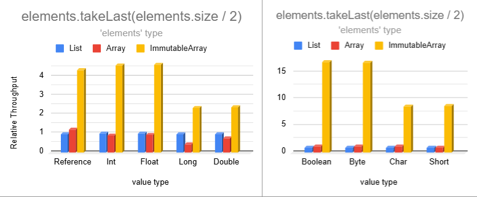
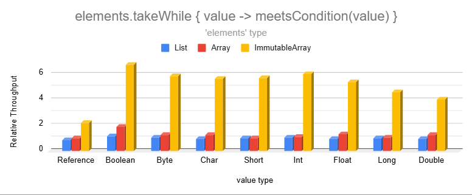
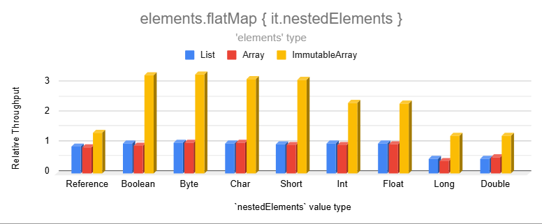
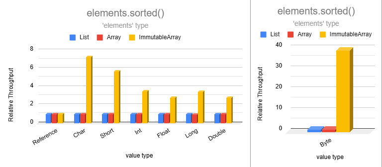
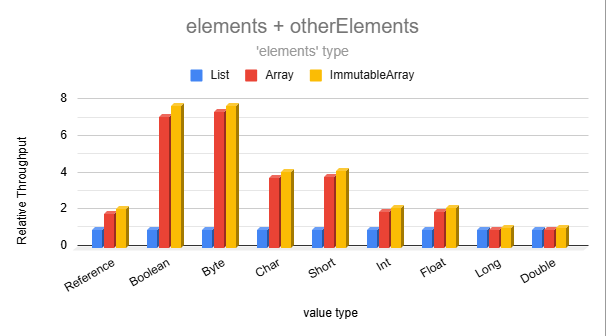

# Immutable Arrays

Immutable Arrays offer a safer and more efficient alternative to read-only lists while maintaining the same look and
feel. They combine the safety of true immutability with hundreds of array-level optimizations resulting in significant
performance and memory improvements.

Immutable arrays are inline classes that compile to regular arrays in the generated bytecode while eliminating mutating
capabilities and replacing common operations with highly-optimized versions.

If you find this library useful, please consider giving it
a [](https://github.com/daniel-rusu/pods4k)
on [GitHub](https://github.com/daniel-rusu/pods4k) and sharing it with others.

* [Key Benefits](#key-benefits)
* [Benchmarks](#benchmarks)
* [Usage](#usage)
* [Benefits vs Alternatives](#benefits-vs-alternatives)
* [Memory Layout](#memory-layout)
* [Caveats](#caveats)

## Key Benefits

* **Clean & Familiar**
    * Uses a list-like syntax ensuring easy adoption with clean code.
* **True Immutability**
    * Unlike read-only lists, Immutable Arrays cannot be mutated through casting.
* **Memory Efficient**
    * Up to 32 times less memory than lists for many common operations!
* **Fast**
    * 2 to 8 times faster than lists for many common operations, with some even faster!
* **Type Safety**
    * Accidental mutation attempts are prevented at compile time.

Ideal for memory-constrained environments, performance-critical workloads, or simply for ensuring data integrity.
Immutable Arrays are ideal for Android and backend JVM applications.

## Benchmarks

<details>
<summary>Benchmark Setup</summary>

Benchmarks use the [Java Microbenchmark Harness](https://github.com/openjdk/jmh) to ensure accurate results.

1,000 collections are randomly generated with sizes chosen from the following probability distribution in order to
resemble the real world:

- 35% between 0 and 10 elements
- 30% between 11 and 50 elements
- 20% between 51 and 200 elements
- 10% between 201 and 1,000 elements
- 5% between 1,001 and 10,000 elements

To measure the performance of an operation, we measure how many collections can be processed per second. This is
repeated across 27 configurations: 3 collection types (lists, arrays, & immutable arrays) and 9 data types (Boolean,
Int, String, etc.). When measuring the performance of a data type across the 3 collection types, each collection
operates on identical, randomly-generated data. See benchmark sources
in [pods4k-benchmarks](https://github.com/daniel-rusu/pods4k-benchmarks) for full details.

Results are normalized to list performance

- 1,000 ops/sec for lists vs. 1,500 for arrays = relative throughput of 1.5.

</details>

Note that comparisons against regular arrays are like-for-like (eg. `ImmutableIntArray` vs `IntArray`) to give regular
arrays the best possible result. To interpret the charts, when the `elements` type is `Array` and the data type
is `Boolean` then a primitive `BooleanArray` is used etc.

### Copy Operations

Operations that copy ranges of values have significantly higher performance than lists and even regular arrays. The
smaller data types are split into a separate chart to avoid skewing the chart axis since their performance is too high!


Copy operations on lists or regular arrays accumulate values into an ArrayList one element at a time. However, the same
operations on immutable arrays generate immutable arrays, so we can copy entire ranges of values with the low-level
arraycopy function which uses bulk memory operations to copy multiple elements at a time.



The `takeWhile` & `takeLastWhile` operations perform similarly so we'll just show `takeWhile` for brevity.



The relative performance of the drop operations (`drop`, `dropLast`, `dropWhile`, & `dropLastWhile`) are similar or
higher than the `take` variants above. We're omitting those for brevity.

### Transformation Operations

Transformation are significantly faster than lists and even regular arrays:


Lists and regular arrays incur additional overhead as they accumulate values in an ArrayList. This repeatedly checks
for sufficient list capacity as each element is added. Transformations on immutable arrays generate immutable arrays
avoiding the ArrayList overhead. Additionally, immutable arrays operate on the 8 primitive types directly without
incurring the memory and performance overhead of auto-boxing and unboxing that lists introduce.



Note that regular arrays are slightly slower than lists here because the Kotlin standard library doesn't have a
`flatMap` function that operates on nested arrays. We used `elements.flatMap { it.nestedRegularArray.asList() }` as the
most efficient alternative for regular arrays since `asList()` returns a wrapper without copying the backing array.


Sorting becomes extremely fast for smaller data types!



Combining two immutable arrays into a larger one is much faster than lists for most data types:



### Condition Operations

Immutable arrays are much faster than lists for operations that inspect the data when dealing with one of the 8 base
types:


Lists store generic types forcing primitive values to be auto-boxed. This makes inspecting their values slower as the
wrapper object introduces an extra layer of indirection.

### Benchmark Summary

Immutable arrays are between 2 to 8 times faster than lists for many common operations with some scenarios over 30 times
faster!  Although there are many more operations, the above results should provide a pretty good representation of the
performance improvement of common non-trivial operations.

## Usage

See [dependency instructions](../README.md#dependency) for more details about adding this library to your Gradle or
Maven build.

```kotlin
dependencies {
    implementation("com.danrusu.pods4k:pods4k:<version>")
}
```

Usages look the same as regular lists after construction:

```kotlin
val people = immutableArrayOf(dan, jill, bobby)

people[0] // dan

// Normal iteration with loops, forEach, asSequence, etc.
for (person in people) {
    sendMarketingEmail(person)
}

// All the typical transformations and conditions
val adults = people.filter { it.age >= 18 }
val adultAges = adults.map { it.age }
val adultsSortedByName = adults.sortedBy { it.name }
val containsRetirees = adults.any { it.isRetired() }
// etc.
```

<details>
<summary>Creating Immutable Arrays</summary>

#### Empty Arrays

```kotlin
emptyImmutableArray<String>() // generic ImmutableArray<String>
emptyImmutableBooleanArray() // primitive ImmutableBooleanArray
// ...
```

#### From Values

```kotlin
immutableArrayOf("Bob", "Jane") // ImmutableArray<String>
immutableArrayOf(1, 2, 3) // primitive int array
immutableArrayOf<Int>(1, 2, 3) // generic array with boxed integers
```

#### Generated Elements

```kotlin
ImmutableArray(size = 3) { it.toString() } // ["0", "1", "2"]
ImmutableIntArray(size = 5) { it * it } // [0, 1, 4, 9, 16]
```

#### From Existing Structures

```kotlin

listOfStrings.toImmutableArray() // ImmutableArray<String>
listOfIntegers.toImmutableArray() // primitive ImmutableIntArray
listOfIntegers.toImmutableArray<Int>() // generic ImmutableArray<Int>

// similarly with conversions from regular arrays or other iterables like Set, etc.
```

#### With Build Functions

We can use the build functions when we don't know the resulting size in advance. Build functions are more efficient than
accumulating the values in a collection and converting it to an immutable array.

```kotlin
// Creates generic ImmutableArray<Person>
val adults = buildImmutableArray<Person> {
    for (person in people) {
        if (person.age >= 18) add(person)
    }
}

// Creates primitive ImmutableIntArray
val favoriteNumbers = buildImmutableIntArray {
    people.forEach { addAll(it.favoriteNumbers) }
}
```

#### With Builders

We can use immutable-array builders when accumulating values in more complex scenarios. Builders are more efficient than
accumulating the values in a collection and converting that into an immutable array.

```kotlin
fun getTopStocks(): ImmutableArray<Stock> {
    val topStocksBuilder = ImmutableArray.Builder<Stock>()

    addTrendingStocks(topStocksBuilder)
    addFastestGrowingStocks(topStocksBuilder)

    return topStocksBuilder.build()
}

// primitive variants also have builders e.g. ImmutableBooleanArray.Builder()
```

</details>

<details>
<summary>Accessing Elements</summary>

#### By Position

```kotlin
val names = immutableArrayOf("Dan", "Bob", "Jill")

names[0] // "Dan"
val (first, _, third) = names // first = "Dan", third = "Jill"

// Special access methods
names.single() // similarly with singleOrNull()
names.first() // similarly with firstOrNUll()
names.last() // similarly with lastOrNull()
```

#### By Condition

```kotlin
val numbers = immutableArrayOf(1, 4, 5, 6)

val firstEvenNumber = numbers.first { it % 2 == 0 } // 4
val lastOddNumber = numbers.last { it % 2 == 1 } // 5
// similarly with firstOrNull { condition } and lastOrNull { condition }

numbers.single { it % 3 == 0 } // 6
// similarly with singleOrNull
```

</details>

<details>
<summary>Iterating Elements</summary>

```kotlin
val names = immutableArrayOf("Dan", "Bob", "Jill")

for (name in names) {
    println(name)
}
names.forEach { println(it) }
names.forEachIndexed { index, name -> println("$index: name") }

names.asSequence()
    .filter { /* ... */ }
    .forEach { /* ... */ }
```

</details>

<details>
<summary>Conditions</summary>

```kotlin
val names = immutableArrayOf("Dan", "Bobby", "Jill")

"Jill" in names // true
names.contains("Joe") // false
names.isEmpty() // false

names.all { it.isNotEmpty() } // true
names.any { it.startsWith("B") } // true
names.none { it.length > 10 } // true
// etc.
```

</details>

<details>
<summary>Transformations</summary>

```kotlin
val names = immutableArrayOf("Dan", "Bobby", "Jill")

names.map { it.length } // [3, 5, 4]
names.filter { it.length <= 4 } // ["Dan", "Jill"]
names.take(2) // ["Dan", "Bobby"]
names.sorted() // ["Bobby", "Dan", "Jill"]
names.partition { it.length % 2 == 0 } // Pair(["Jill"], ["Dan", "Bobby"])
// etc.
```

</details>

## Benefits vs Alternatives

| Feature                  | Immutable Arrays | Regular Arrays         | Read-only Lists                      | Unmodifiable Lists          | Java Immutable Lists      |
|--------------------------|------------------|------------------------|--------------------------------------|-----------------------------|---------------------------|
| True Immutability        | ✅                | ❌                      | ❌ <br/>Casting enables mutation      | ❌ <br/>Mutable backing list | ✅                         |
| Memory Efficiency        | ✅✅               | ✅                      | ❌                                    | ❌                           | ❌                         |
| Performance              | ✅✅               | ✅                      | ❌                                    | ❌                           | ❌                         |
| Compile-time Safety      | ✅                | ❌ <br/> Can be mutated | ✅ / ❌ <br/> Casting enables mutation | ❌ <br/> Throws exceptions   | ❌ <br/> Throws exceptions |
| Proper equals & hashCode | ✅                | ❌                      | ✅                                    | ✅                           | ✅                         |
| Meaningful toString()    | ✅                | ❌                      | ✅                                    | ✅                           | ✅                         |

### Benefits over regular arrays

<details>
<summary>Meaningful toString()</summary>

Unlike regular arrays, calling toString() on immutable arrays produces a pretty representation of the data:

```kotlin
println(immutableArrayOf("Dan", "Bob")) // [Dan, Bob]  Nice!

println(arrayOf("Dan", "Bob")) // [Ljava.lang.String;@7d4991ad  Yuck!
```

</details>

<details>
<summary>Efficient sharing of encapsulated data</summary>

Regular arrays can have their elements reassigned making them a poor choice for encapsulated data that needs to be
shared. this forces us to duplicate the contents before sharing so that callers can't mutate the encapsulated array.
Note that calling `asList()` to wrap generic arrays is not safe as casting that to an ArrayList exposes a backdoor to
mutating the shared underlying array.

Duplicating the array negatively affects performance and adds extra pressure on the garbage collector. Immutable arrays
can be safely shared resulting in cleaner and more efficient code.
</details>

<details>
<summary>Efficient operations</summary>

Regular arrays are usually chosen for memory or performance reasons, however these benefits are negated when performing
dozens of common operations since these generate lists auto-boxing the values:

```kotlin
val weights = doubleArrayOf(1.5, 3.0, 10.2, 15.7, 2.0)
val largeWeights = weights.filter { it > 10.0 }
// Oops, this creates a List<Double> auto-boxing each value!
```

Unlike regular arrays, most of the common operations on immutable arrays have specializations resulting in the most
optimal representation so that clean code is efficient by default:

```kotlin
val people = immutableArrayOf(
    Person(name = "Dan", age = 3),
    Person(name = "Bob", age = 4),
) // ImmutableArray<Person>

// Since the age field is a non-nullable Int, Mapping the ages uses an 
// efficient ImmutableIntArray storing primitive int values
val ages = people.map { it.age }
```

Here's a non-exhaustive list of operations that take advantage of primitives resulting in significant memory and
performance improvements over regular arrays:

* drop
* dropLast
* dropLastWhile
* dropWhile
* filter
* filterIndexed
* filterNot
* filterNotNull
* flatMap
* flatMapIndexed
* flatten
* map
* mapNotNull
* mapIndexed
* mapIndexedNotNull
* partition
* sorted
* sortedBy
* sortedByDescending
* sortedDescending
* sortedWith
* take
* takeLast
* takeLastWhile
* takeWhile
* etc.

</details>

<details>
<summary>Avoids equality & hashCode defects</summary>

Unlike regular arrays, Immutable arrays have proper equals & hashCode implementations allowing us to check equality:

```kotlin
arrayOf("Dan", "Bob") == arrayOf("Dan", "Bob") // false!

// Yes, this condition will be true when immutable arrays have equal contents
immutableArrayOf("Dan", "Bob") == immutableArrayOf("Dan", "Bob") // true
```

Since we can compare lists directly, developers occasionally attempt to do the same with regular arrays. Even worse,
defects can sneak in without obvious usages of these broken behaviors:

```kotlin
data class Order(val id: Long, private val products: Array<Product>)

val rejectedOrders = mutableSetOf<Order>()
// Oops, attempting to add Orders to a hashSet will make use of the auto-generated 
// equals & hashCode methods from the Order data class which will in turn rely on 
// the defective equals & hashCode implementation of regular arrays
```

Swapping `Array<Product>` with `ImmutableArray<Product>` will fix this defect scenario.

</details>

<br>

### Benefits over read-only lists

<details>
<summary>Casting doesn't introduce backdoor for mutation</summary>

Read-only lists appear to be immutable at first, but they can be cast into a `MutableList` and modified:

```kotlin
val values = listOf(1, 2, 3)
(values as MutableList)[0] = 100 // backdoor to mutation
println(values) // [100, 2, 3]
```

Immutable arrays don't have this backdoor:

```kotlin
val values = immutableArrayOf(1, 2, 3)
values[0] = 100 // Compiler error: No set method providing array access

@Suppress("CAST_NEVER_SUCCEEDS")
(values as IntArray)[0] = 100
// ClassCastException: ImmutableIntArray cannot be cast to [I
```

</details>

<details>
<summary>More memory efficient</summary>

Read-only lists use between 3.5 to 32 times more memory than immutable arrays when storing or performing operations that
produce primitive values (E.g. `people.map { it.age }`). See the **Memory Impacts** section
in [Memory Layout](#memory-layout) for details.

Read-only lists also have 17% unused capacity on average when the resulting capacity isn't known in advance. There's
also the small memory overhead of the `ArrayList` class whereas variables of immutable array types point directly at the
backing array in the generated bytecode.

</details>

<details>
<summary>Higher performance</summary>

Most operations are significantly faster on immutable arrays compared to lists. Operations on immutable arrays have been
optimized to reduce memory footprint, improve cache locality, and reduce the number of memory hops.

</details>

<br>

### Benefits over unmodifiable lists

<details>
<summary>Safer and more robust</summary>

Calling `Collections.unmodifiableList(myMutableList)` doesn't copy the elements into a new immutable list but rather
creates a view that wraps the original collection. Although the view won't allow mutation, the underlying collection
that the view references can continue to be mutated. This introduces a category of defects where a view is shared and
intended to be processed right away but the underlying list is modified again before the view is processed. This can
happen when the view is shared and then a separate thread mutates the underlying list. Another scenario is when the
handling logic gets updated to delay the processing to a later time such as by adding it to some worker queue.

Immutable arrays don't have this problem as they can never be mutated.

</details>

<details>
<summary>No mutation exceptions at runtime</summary>

Unmodifiable lists implement the Java `List` interface and override mutating methods to throw exceptions. Although
mutation is prevented at the view level, bad usages result in runtime exceptions affecting the user experience.

Attempting to mutate an immutable array won't even compile preventing this category of defects altogether.

</details>

<details>
<summary>More memory efficient</summary>

Unmodifiable lists have the same memory drawbacks as read-only lists
(see [Benefits over read-only lists](#benefits-over-read-only-lists)) along with a tiny extra overhead from the wrapper.

</details>

<details>
<summary>Higher performance</summary>

Unmodifiable lists have similar performance drawbacks as read-only lists
(see [Benefits over read-only lists](#benefits-over-read-only-lists)) but slightly worse due to the extra layer of
indirection caused by the view wrapper.

</details>

<br>

### Benefits over immutable lists from Java (such as Guava)

<details>
<summary>No mutation exceptions at runtime</summary>

Immutable lists defined in Java implement the mutable Java `List` interface and override mutating methods to throw
exceptions. Although this prevents mutation, bad usages result in runtime exceptions affecting the user experience.

Attempting to mutate an immutable array won't even compile preventing this category of defects altogether.

</details>

<details>
<summary>More memory efficient</summary>

Immutable lists use between 3.5 to 32 times more memory than immutable arrays when storing or performing operations that
produce primitive values (E.g. `people.map { it.age }`). See the **Memory Impacts** section
in [Memory Layout](#memory-layout) for details.

There's also the small memory overhead of the immutable list class whereas variables of immutable array types point
directly at the backing array in the generated bytecode.

</details>

<details>
<summary>Higher performance</summary>

Immutable lists have the same performance drawbacks as read-only lists
(see [Benefits over read-only lists](#benefits-over-read-only-lists)).

</details>

## Memory Layout

Performing some operation that results in an `ImmutableIntArray` ends up with the following memory layout:


Note that the `values` variable of type `ImmutableIntArray` actually references a regular primitive int array in the
bytecode.

Here is the same example but operating on a regular primitive array and ending up with a read-only list:


Classes that operate on generics, such as lists, can't store primitive types directly. Each primitive int gets
auto-boxed into an `Integer` wrapper object and a pointer to that wrapper is passed to the resulting list. These wrapper
objects are allocated in different regions of memory depending on availability and the garbage collector also
periodically moves surviving objects around, so we can end up with the objects scattered throughout the heap.

Primitive arrays benefit from faster CPU memory access due to their contiguous memory layout, while lists with scattered
wrapper objects face higher memory latency due to the extra indirection.

<details>
<summary>Memory Impacts</summary>

1. Notice that the list contains 7 values but the backing array has a capacity of 10. When an `ArrayList` runs out of
   capacity, the backing array is replaced with a new array that's 1.5-times larger and the elements get copied over. On
   average, array lists end up with about 17% of unused capacity when the exact capacity isn't known ahead of time.

2. A primitive int uses just 4 bytes. However, an `Integer` wrapper object requires 16 bytes for the object header, plus
   4 bytes for the int value, plus another 4 bytes of padding totaling 24 bytes. Enabling JVM pointer compression
   reduces this to 16 bytes per wrapper.

3. Lists don't store the wrappers directly but instead store pointers to each of these wrappers. So a list of integers
   uses 8 + 24 = 32 bytes to store each 4-byte int value!  Enabling JVM pointer compression reduces this to 20 bytes per
   integer element but that's still 5X the memory of primitive int arrays!

4. The ratio becomes worse when storing smaller data types. E.g. A list of booleans uses 32X more memory than primitive
   boolean arrays without JVM pointer compression and still 20X more memory with JVM pointer compression enabled!

The following table shows the per-element memory usage on a 64-bit JVM accounting for the size of the element pointer,
wrapper object header, value, and padding in the wrapper object to account for memory alignment:

| Type    | Immutable Array<br/>(bytes per element) | ArrayList<br/>JVM compressed oops disabled<br/>(bytes per element) | ArrayList<br/>JVM compressed oops enabled<br/>(bytes per element) |
|---------|-----------------------------------------|--------------------------------------------------------------------|-------------------------------------------------------------------|
| Boolean | **1**                                   | 8 + (16 + 1 + 7) = **32**                                          | 4 + (12 + 1 + 3) = **20**                                         |
| Byte    | **1**                                   | 8 + (16 + 1 + 7) = **32**                                          | 4 + (12 + 1 + 3) = **20**                                         |
| Char    | **2**                                   | 8 + (16 + 2 + 6) = **32**                                          | 4 + (12 + 2 + 2) = **20**                                         |
| Short   | **2**                                   | 8 + (16 + 2 + 6) = **32**                                          | 4 + (12 + 2 + 2) = **20**                                         |
| Int     | **4**                                   | 8 + (16 + 4 + 4) = **32**                                          | 4 + (12 + 4 + 0) = **20**                                         |
| Float   | **4**                                   | 8 + (16 + 4 + 4) = **32**                                          | 4 + (12 + 4 + 0) = **20**                                         |
| Long    | **8**                                   | 8 + (16 + 8 + 0) = **32**                                          | 4 + (12 + 8 + 4) = **28**                                         |
| Double  | **8**                                   | 8 + (16 + 8 + 0) = **32**                                          | 4 + (12 + 8 + 4) = **28**                                         |

</details>

## Caveats

<details>
<summary>Relies on experimental Kotlin features</summary>

The following experimental features are used which could change in future Kotlin releases:

* [Inline value classes](https://kotlinlang.org/docs/inline-classes.html)
    * These enable zero cost abstractions that are eliminated at compile time. The immutable array classes are inline
      value classes.
    * This feature was introduced in Kotlin 1.3 and is used by some standard library features
      like [unsigned integer types](https://kotlinlang.org/docs/unsigned-integer-types.html).
* [Overload resolution by lambda return type](https://kotlinlang.org/api/latest/jvm/stdlib/kotlin/-overload-resolution-by-lambda-return-type/)
    * This enables the hundreds of optimized specializations that make use of overloaded functions containing parameters
      with different lambda return types. Without this feature, these overloaded functions would result in a runtime
      signature clash on the JVM.
    * This feature was introduced in Kotlin 1.4 and is used extensively throughout the Kotlin standard library.
* [Custom equals in value classes](https://youtrack.jetbrains.com/issue/KT-24874/Support-custom-equals-and-hashCode-for-value-classes)
    * This enables overriding the equals & hashcode methods for inline value classes.
    * This feature was added for the JVM IR backend (which handles both Android & regular backend JVM development) in
      Kotlin 1.9 but hasn't been announced yet because the other backends were not ready. Since this isn't a Kotlin
      multiplatform library, the lack of support in the other backends won't affect us.
    * Vote and comment on this [YouTrack ticket](https://youtrack.jetbrains.com/issue/KT-24874) to raise the importance
      of this feature so that we can use it without the extra experimental opt-in.

</details>

<details>
<summary>Shallow immutability</summary>

Immutable arrays prevent adding, removing, or replacing elements. However, the elements themselves could be mutable:

```kotlin
val people = immutableArrayOf(Person("Bob"), Person("Jane"))

people[0].spouse = Person("Jill")
```

</details>

<details>
<summary>Auto-boxing</summary>

Immutable arrays are zero-cost abstractions that get eliminated at compile time. All variables, properties, function
arguments, function receiver types, or return types that explicitly use the immutable array types get replaced
at compile time to operate directly on the underlying array without any auto-boxing or wrapper object.

The Kotlin compiler adds additional instructions everywhere the immutable array is interpreted as a generic type, or by
a supertype like `Any` or `Any?`. In these scenarios, the immutable array is auto-boxed into a single tiny wrapper
object which stores a reference to the actual array. Note that this auto-boxing is different from lists as lists
auto-box each primitive element.

Generic functions that are marked with the `inline` modifier, such as `with` from the Kotlin standard library, don't
induce auto-boxing because the function is inlined into each call site replacing the generic with the actual type.

When using reflection to traverse the object graph, reflective code will encounter the underlying array directly except
for the auto-boxing scenarios, in which case it will encounter the tiny wrapper.

Here are some examples to get a better idea of where auto-boxing occurs:

```kotlin
// no auto-boxing.  `names` references the underlying array directly
val names = immutableArrayOf("Dan", "Bob")

// no auto-boxing because `with` is an inline function so the generic parameter gets replaced at compile time
with(names) {
    println(this.size)
}

// casting induces auto-boxing.  This prevents any backdoor to the underlying array 
names as Any

// auto-boxing since println accepts a variable of type Any
println(names)

// Avoid println auto-boxing by calling toString() explicitly but the benefit is negligible if it's not in a loop
println(names.toString()) // no auto-boxing since we're not passing the immutable array itself

// Even though we're explicitly specifying the ImmutableArray type as the generic type, the ArrayList 
// class itself isn't hardcoded to work with immutable arrays, so each immutable array must be auto-boxed
val arrays = ArrayList<ImmutableArray<String>>()
arrays += names // auto-boxing due to generics

// auto-boxing because the immutable array is used as a generic receiver
names.genericExtensionFunction()

fun <T> T.genericExtensionFunction() {
    // ...
}
```

The overhead of auto-boxing the entire array is identical to that of autoboxing a single primitive `Double` value. Since
this is referring to the entire immutable array, the memory or performance overhead of this operation is negligible in
most scenarios unless it's part of a tight inner loop. Normally auto-boxing can have a large memory or performance
impact when auto-boxing many values like what happens with read-only lists. However, in this case the immutable array
itself is auto-boxed into a single tiny wrapper without auto-boxing any of the elements.

For optimal performance, we recommend explicitly using the immutable array types for everything that expects to work
with immutable arrays as this avoids auto-boxing. Passing immutable arrays to generic inline functions as the generic
type also avoids auto-boxing since the generic parameter is replaced at compile time.

</details>

<details>
<summary>No identity</summary>

Immutable arrays are zero-cost abstractions that get eliminated at compile time. In a way, we can think of them as a
kind of virtual quantum particle that comes in and out of existence (see Auto-boxing above).

Since immutable arrays aren't persistent wrapper objects, attempting to use their identities is not supported. Here are
some patterns that attempt to make use of their identities:

Reference equality:

```kotlin
fun doSomething(array: ImmutableArray<String>) {
    // Note the `===` reference equality.
    // Regular structural equality using `==` is allowed and works as expected
    if (array === otherImmutableArray) { // Compiler error: Identity equality is forbidden
        return
    }
    //...
}
```

Identity hashCode:

```kotlin
val values = immutableArrayOf(1, 2, 3)
val identityHashCode = System.identityHashCode(values)
// Oops, identityHashCode accepts Any type instead of an immutable array type, so it's auto-boxed 
// and the identity hashCode of that temporary wrapper is returned which is meaningless
```

Synchronization:

```kotlin
class Account(val accountHolders: ImmutableArray<Person>) {
    fun withdraw(amount: Money) {
        // Compiler warning: Synchronizing by ImmutableArray<Person> is forbidden
        synchronized(accountHolders) {
            // Oops, synchronized accepts Any type instead of an immutable array type, so it's 
            // auto-boxed.  We're meaninglessly synchronizing on that temporary wrapper
            balance -= amount
        }
    }
}
```

</details>
