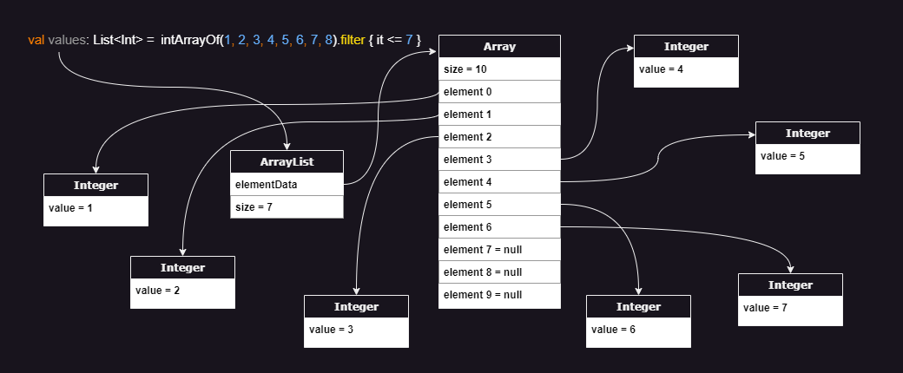

# Immutable Arrays

Immutable Arrays provide a safer and more efficient alternative to read-only lists while maintaining familiar
operations. They compile to regular arrays in the generated bytecode but without mutating capabilities and with hundreds
of specialized optimizations.

If you're enjoying this library, support us by starring and sharing this repo with others.

## Table of Contents

* [Key Features](#key-features)
    * [Simple & Readable](#simple--readable)
    * [True Immutability](#true-immutability)
    * [Memory Efficient](#memory-efficient)
    * [Performance Optimizations](#performance-optimizations)
* [Usage](#usage)
* [Memory Layout](#memory-layout)
* [Benefits over alternatives](#benefits-over-alternatives)
    * [Versus regular arrays](#benefits-over-regular-arrays)
    * [Versus read-only lists](#benefits-over-read-only-lists)
    * [Versus unmodifiable lists](#benefits-over-unmodifiable-lists)
    * [Versus immutable lists](#benefits-over-immutable-lists)

## Key Features

### Simple & Readable

* Immutable arrays have the same operations that we're already familiar with so usages look pretty much the same as how
  we use lists:
    ```kotlin
    val people = immutableArrayOf(
        Person(name = "Dan", age = 10),
        Person(name = "Bob", age = 20),
        Person(name = "Jill", age = 30),
    )
    println(people[0].name) // "Dan"
    val adults = people.filter { it.age >= 18 } // ImmutableArray[Bob, Jill]
    
    for (person in people) {
        println(person)
    }
    ```

### True Immutability

* Unlike read-only lists, immutable arrays cannot be mutated through casting. This allows immutable arrays to be safely
  shared without needing immutable collections.
* Mutation attempts result in IDE errors and fail to compile:
    ```kotlin
    val names = immutableArrayOf("Dan", "Bob")
    names[1] = "Jane" // Compile error: No set method providing array access
    ```

### Memory Efficient

* Immutable arrays use between **3 to 24 times less memory** than lists when storing values of one of the 8 base types:
    * `Long` & `Double` -> **3** times less
    * `Int` & `Float` -> **5** times less
    * `Char` & `Short` -> **12** times less
    * `Byte` & `Boolean` -> **24** times less
* When JVM compressed oops is not enabled, the improvement is even greater ranging from 4 to 32 times less memory!

### Performance Optimizations

* Primitive arrays can be between 3.5X to 12X faster than lists when operating on the 8 base types.
* Hundreds of specializations have been added for when operating on or transforming into the 8 base types. These
  specializations are automatically bound by the compiler so developers can focus on writing clean code:
    ```kotlin
    // Resulting immutable array stores primitive ints because `age` is a non-nullable Int
    val ages = people.map { it.age } // ImmutableIntArray[10, 20, 30]
    ```
* In addition to being more efficient than lists, immutable arrays are also more efficient than regular arrays when
  encountering a specialization. For example, `people.map { it.age }` uses 5 times less memory and is more performant
  when `people` is an `ImmutableArray` instead of a regular array.

## Usage

See [dependency instructions](../README.md#dependency) for adding this library to your gradle or maven build.

<details>
<summary>Creating immutable arrays</summary>

**Empty immutable arrays:**

Creating empty arrays just references 1 of the 9 pre-allocated empty singletons:

```kotlin
emptyImmutableArray<String>()
emptyImmutableBooleanArray()
emptyImmutableFloatArray()
...
```

**Immutable array of values:**

```kotlin
immutableArrayOf("Bob", "Jane") // ["Bob", "Jane"]

// Providing values of one of the 8 base types will automatically result in an efficient primitive array
immutableArrayOf(1, 2, 3) // [1, 2, 3] primitive int array

// Specifying the generic type forces a generic array, so the 8 base types will be auto-boxed
immutableArrayOf<Int>(1, 2, 3) // [Integer(1), Integer(2), Integer(3)]
```

**Immutable array with generated elements:**

```kotlin
ImmutableArray(size = 3) { index -> index.toString() } // ["0", "1", "2"]

ImmutableIntArray(size = 5) { it * it } // [0, 1, 4, 9, 16]

ImmutableBooleanArray(size = 3) { it % 2 == 0 } // [true, false, true]
```

**Creating from regular arrays:**

```kotlin
val regularArray = arrayOf("Bob", "Jane")
regularArray.toImmutableArray()

// Creating from arrays of auto-boxed values will maintain the same type keeping those wrapper objects:
val autoBoxedBooleans = arrayOf(true, false, true) // [Boolean(true), Boolean(false), Boolean(true)]
autoBoxedBooleans.toImmutableArray() // [Boolean(true), Boolean(false), Boolean(true)]

// However, you can choose the more efficient primitive array type instead:
autoBoxedBooleans.toImmutableBooleanArray() // [true, false, true]
```

**Creating from collections:**

```kotlin
val list = listOf(1, 2, 3)

// Creating from collections of auto-boxed values will maintain the same type keeping those wrapper objects:
list.toImmutableArray() // [Integer(1), Integer(2), Integer(3)]

// However, you can choose the more efficient primitive array type instead:
list.toImmutableIntArray() // [1, 2, 3] primitive int array
```

</details>

<details>
<summary>Accessing elements</summary>

**Accessing by index:**

```kotlin
val names = immutableArrayOf("Dan", "Bob", "Jill")

names[0] // "Dan"
names.get(1) // "Bob"
```

**Accessing by destructuring:**

```kotlin
val names = immutableArrayOf("Dan", "Bob", "Jill", "Jane")

val (first, second) = names // first = "Dan", second = "Bob"
val (_, second, _, fourth) // second = "Bob", fourth = "Jane"
```

**Accessing the only element:**

```kotlin
val names = immutableArrayOf("Dan")

names.single() // "Dan"

// Similarly with `singleOrNull()` for when the array might not have exactly 1 element
```

**Accessing the first & last elements:**

```kotlin
val names = immutableArrayOf("Dan", "Bob", "Jill")

names.first() // "Dan"
names.last() // "Jill"

// Similarly with `firstOrNull()` & `lastOrNull()` for when the array might be empty
```

**Accessing by condition:**
```kotlin
val numbers = immutableArrayOf(1, 2, 3, 4, 5)

names.first { it % 2 == 0 } // 2
names.last { it % 2 == 0} // 4

names.firstOrNull { it > 5 } // null
names.lastOrNull { it > 5 } // null

names.single { it % 3 == 0 } // 3
names.singleOrNull { it % 2 == 0 } // null because multiple elements match
```

</details>

## Memory Layout

Performing some operation that results in an `ImmutableIntArray` ends up with the following memory layout:


Note that the `values` variable of type `ImmutableIntArray` actually references a regular primitive int array in the
bytecode.

Here is the same example but operating on a regular primitive array and ending up with a read-only list:



Classes that operate on generics, such as lists, can't store primitive types directly. Each 32-bit integer gets
auto-boxed into an `Integer` wrapper object and a pointer to that wrapper is passed to the resulting list. The garbage
collector periodically moves surviving objects around, so we can end up with the objects scattered throughout the heap.

<details>
<summary>Memory Impacts</summary>

1. Notice that the list contains 7 values but the backing array has a size of 10 with 3 null elements.  `ArrayList`
   starts with a default capacity of 10. As elements pass the filter criteria and get added to the array, if the backing
   array becomes full, a new array that's 1.5 times larger is created and the elements are copied over. On average,
   array lists end up with about 17% of unused capacity when the exact size isn't known ahead of time.

2. Although a 32-bit integer needs just 4 bytes to represent the value, in a typical 64-bit JVM environment,
   an `Integer` wrapper object requires 16 bytes for the object header, 4 bytes for the actual integer value, plus
   another 4 bytes of padding totalling 24 bytes. If we enable pointer compression, we can reduce this down to 16 bytes
   per wrapper.

3. In addition to the size of the `Integer` wrapper objects, the backing array stores pointers to the memory address of
   each of these wrappers. So ignoring the memory overhead of the list object and ignoring the unused over-provisioned
   spots, we need 32 bytes to store each 4-byte integer value!  With pointer compression, we can reduce this down to 20
   bytes for each 4-byte integer but that's still a 5X memory overhead!

The following table shows the per-element memory consumption on a 64-bit JVM accounting for the size of the reference
that points to the wrapper object, wrapper object header, value, and padding in the wrapper object to account for memory
alignment:

| Type    | Immutable Array<br/>(bytes per element) | ArrayList<br/>(bytes per element) | ArrayList on JVM with compressed oops<br/>(bytes per element) |
|---------|-----------------------------------------|-----------------------------------|---------------------------------------------------------------|
| Boolean | **1**                                   | 8 + 16 + 1 + 7 = **32**           | 4 + 12 + 1 + 7 = **24**                                       |
| Byte    | **1**                                   | 8 + 16 + 1 + 7 = **32**           | 4 + 12 + 1 + 7 = **24**                                       |
| Char    | **2**                                   | 8 + 16 + 2 + 6 = **32**           | 4 + 12 + 2 + 6 = **24**                                       |
| Short   | **2**                                   | 8 + 16 + 2 + 6 = **32**           | 4 + 12 + 2 + 6 = **24**                                       |
| Int     | **4**                                   | 8 + 16 + 4 + 4 = **32**           | 4 + 12 + 4 + 4 = **24**                                       |
| Int     | **4**                                   | 8 + 16 + 4 + 4 = **32**           | 4 + 12 + 4 + 4 = **24**                                       |
| Float   | **4**                                   | 8 + 16 + 4 + 4 = **32**           | 4 + 12 + 4 + 4 = **24**                                       |
| Long    | **8**                                   | 8 + 16 + 8 + 0 = **32**           | 4 + 12 + 8 + 0 = **24**                                       |
| Double  | **8**                                   | 8 + 16 + 8 + 0 = **32**           | 4 + 12 + 8 + 0 = **24**                                       |

</details>

<details>
<summary>Performance Impacts</summary>

When performing a trivial operation like `readOnlyList.get(index) + 1`, the following steps are performed behind the
scenes (note that this is a simplified explanation of the main steps):

1. Fetch the memory at the address specified by the `readOnlyList` variable to load the ArrayList object.
2. Ensure that `index` is smaller than the list size (enforced by the ArrayList class).
3. Fetch the memory at the address specified by the `elementData` variable from the `ArrayList` class to load the
   backing array object.
4. Ensure that `index` is smaller than the array size. This second check is enforced by the JVM for array accesses.
5. Compute the array address of that element into the array (ie. `offset + elementSize * index`)
6. Fetch the memory at that computed location into the array, interpreting it as a pointer, and return that pointer
   back up the chain to the caller of `readOnlyList.get(index)`.
7. Fetch the memory specified by that pointer to get the `Integer` wrapper object.
8. Cast the object to an `Integer` by validating the object header (since generics are erased at compile time).
9. Unbox the `Integer` object into a primitive `int` and finally add 1.

Notice how many steps and memory hops are performed to fetch a single value! Iterating through read-only lists in tight
loops and performing operations on primitive values performs very poorly on modern CPU architectures. That's because
these values are scattered throughout memory resulting in very poor cache locality.

Fetching data from main memory can take several hundred cycles on modern CPU architectures. The CPU tries to minimize
this latency by fetching in bulk and predicting addresses that will be requested to pre-fetches data before it's
actually requested. Iterating through a primitive array is predictable as they are stored in a contiguous block of
memory. With primitive arrays, the CPU will fetch the initial element along with neighboring elements, so subsequent
elements are already loaded in the much quicker CPU caches by the time they're requested. However, the CPU pre-fetcher
has a tough time predicting the address of scattered memory requiring several hundred extra cycles to access each new
element if that hasn't already been fetched.

To get an idea of the potential performance impact of wrapper objects, Java Language Architect, Brian Goetz, ran some
benchmarks replacing reference carriers with values as part of project Valhalla exploration. Brian found performance
improvements ranging from 3.5x to 12x faster: [YouTube presentation](https://youtu.be/1H4vmT-Va4o?t=899)

</details>

## Benefits over alternatives

### Benefits over regular arrays

<details>
<summary>Meaningful toString()</summary>

Unlike regular arrays, calling toString() on immutable arrays produces a pretty representation of the data:

```kotlin
println(immutableArrayOf("Dan", "Bob")) // [Dan, Bob]  Nice!
println(arrayOf("Dan", "Bob")) // [Ljava.lang.String;@7d4991ad  Yuck!
```

</details>

<details>
<summary>Efficient sharing of encapsulated data</summary>

Regular arrays can have their elements reassigned making them a poor choice for encapsulated data that needs to be
occasionally shared. Using a regular array forces us to duplicate the contents before sharing so that callers can't
mutate the encapsulated array. This negatively affects performance and adds extra pressure on the garbage collector.
Immutable arrays can be safely shared resulting in cleaner and more efficient code.
</details>

<details>
<summary>Efficient operations</summary>

Regular arrays are usually chosen for memory or performance reasons, however these benefits are negated when performing
dozens of typical operations:

```kotlin
val weights = doubleArrayOf(1.5, 3.0, 10.2, 15.7, 2.0)
val interestingWeights = weights.filter { it > 10.0 }
// Oops, all our effort is in vain as this results in a 
// List<Double> auto-boxing each resulting value!
```

Unlike regular arrays, most of the common operations on immutable arrays have specializations so that clean code is
efficient by default:

```kotlin
val people = immutableArrayOf(
    Person(name = "Dan", age = 3),
    Person(name = "Bob", age = 4),
) // ImmutableArray<Person>

// Since the age field is a non-nullable Int, Mapping the ages uses an 
// efficient ImmutableIntArray storing primitive int values
val ages = people.map { it.age }
performStatisticalAnalysis(ages)
```

Here's a non-exhaustive list of operations that benefit from specializations resulting in significant efficiency
improvements (note that some of these will be added in future releases):

* map
* mapNotNull
* mapIndexed
* flatMap
* flatMapIndexed
* filter
* filterIndexed
* filterNot
* filterNotNull
* take
* takeWhile
* takeLast
* takeLastWhile
* drop
* dropWhile
* dropLast
* dropLastWhile
* reversed
* sorted
* sortedWith
* sortedBy
* sortedDescending
* sortedByDescending
* partition
* slice
* distinct
* distinctBy
* etc.

</details>

<details>
<summary>Avoids equality & hashCode defects</summary>

Unlike regular arrays, Immutable arrays have a proper equals & hashCode implementation allowing us to compare them in
the same way that we compare lists:

```kotlin
// Yes, this condition will be true when the immutable arrays have identical contents
if (immutableArrayOf(1, 2) == immutableArrayOf(1, 2)) return
```

Since we can compare 2 lists directly, developers occasionally attempt to do the same with regular arrays. Even worse,
defects can sneak in without obvious usages of these broken behaviors:

```kotlin
data class Order(val id: Long, private val products: Array<Product>)

val rejectedOrders = mutableSetOf<Order>()
// Oops, attempting to add Orders to a hashSet will make use of the auto-generated 
// equals & hashCode methods from the Order data class which will in turn rely on 
// the defective equals & hashCode implementation of regular arrays
```

</details>

### Benefits over read-only lists

<details>
<summary>Casting doesn't introduce backdoor for mutation</summary>

Read-only lists appear to be immutable at first as they don't expose any mutating methods. However, they can be cast
into a `MutableList` and modified:

```kotlin
val values = listOf(1, 2, 3)
values[0] = 2 // Compiler error: No set method providing array access

(values as MutableList)[0] = 100
println(values) // [100, 2, 3]
```

Immutable arrays don't have this backdoor:

```kotlin
val values = immutableArrayOf(1, 2, 3)
values[0] = 2 // Compiler error: No set method providing array access

@Suppress("CAST_NEVER_SUCCEEDS")
(values as IntArray)[0] = 100
// ClassCastException: ImmutableIntArray cannot be cast to [I
```

</details>

<details>
<summary>More memory efficient</summary>

Read-only lists containing one of the eight base types, like `List<Int>`, use between 5 to 8 times more memory than
immutable arrays! See the **Memory Impacts** section in [Memory Layout](#memory-layout) for details.

Even when storing generic types, read-only lists still use more memory as their backing array usually has about 17% of
unused capacity. There's also the small memory overhead of the `ArrayList` class whereas variables of immutable array
types point directly at the backing array in the bytecode.

</details>

<details>
<summary>Higher performance</summary>

Executing tight loops on read-only lists containing one of the eight base types, like `List<Int>`, can be over 10 times
slower than immutable arrays. See the `Performance Impacts` section in [Memory Layout](#memory-layout) for details.

Even when operating on generic types, read-only lists have an extra layer of indirection since method calls such as
getting an element, are routed through the `ArrayList` class whereas getting an element from an immutable array accesses
the array element directly. This is because immutable arrays are a zero-cost abstraction that gets eliminated at compile
time.

</details>

### Benefits over unmodifiable lists

<details>
<summary>Safer and more robust</summary>

Calling `Collections.unmodifiableList(myMutableList)` doesn't copy the elements into a new immutable list but rather
creates a view that wraps the original collection. Although the view won't allow mutation, the underlying collection
that the view references can continue to mutate. This introduces a category of defects where a view is shared and
intended to be processed right away but the underlying mutable list is modified again before it's processed. This can
happen when the view is shared and then a separate thread mutates the underlying list. Another scenario is when the
processing logic is enhanced to delay the processing to a later time such as by adding it to some processing queue.

Immutable arrays don't have this problem as they can never be mutated by anyone.

</details>

<details>
<summary>No mutation exceptions at runtime</summary>

Unmodifiable lists implement the Java `List` interface and override mutating methods to throw exceptions. Although
this prevents mutation at the view level, it can result in exceptions being thrown at runtime affecting the user
experience.

However, attempting to mutate an immutable array won't even compile preventing this category of defects altogether.

</details>

<details>
<summary>More memory efficient</summary>

Unmodifiable lists have the same memory drawbacks as read-only lists
(see [Benefits over read-only lists](#benefits-over-read-only-lists)) along with a tiny extra overhead from the wrapper.

</details>

<details>
<summary>Higher performance</summary>

Unmodifiable lists have the performance drawbacks of read-only lists
(see [Benefits over read-only lists](#benefits-over-read-only-lists)) but even worse due to the extra layer of
indirection caused by the wrapper object.

</details>

### Benefits over immutable lists

<details>
<summary>No mutation exceptions at runtime</summary>

Immutable lists implement the Java `List` interface and override mutating methods to throw exceptions. Although this
prevents mutation, it can result in exceptions being thrown at runtime affecting the user experience.

However, attempting to mutate an immutable array won't even compile preventing this category of defects altogether.

</details>

<details>
<summary>More memory efficient</summary>

Immutable lists containing one of the eight base types, like List<Int>, use between 5 to 8 times more memory than
immutable arrays! See the Memory Impacts section in Memory Layout for details.

There's also the small memory overhead of the immutable list class whereas variables of immutable array types point
directly at the backing array in the bytecode.

</details>

<details>
<summary>Higher performance</summary>

Immutable lists have the same performance drawbacks as read-only lists
(see [Benefits over read-only lists](#benefits-over-read-only-lists)).

</details>

## Caveats

<details>
<summary>Shallow immutability</summary>

Similar to Guava immutable lists, immutable arrays only prevent mutation of the array so that elements cannot be added,
removed, or replaced. However, the elements themselves can still be mutated if they expose mutating capabilities:

```kotlin
class Person(val name: String, var spouse: Person? = null)

val people = immutableArrayOf(
    Person("Bob"),
    Person("Jane"),
)

// The `people` immutable array is protected against mutation
people[0] = Person("Dan") // Compile error: No set method providing array access

// However, a `Person` instance can be mutated since it exposes `spouse` as a var property 
people[0].spouse = Person("Jill")
```

</details>

<details>
<summary>Auto-boxing</summary>

Immutable arrays are zero-cost abstractions that get eliminated at compile time. All variables, properties, function
arguments, function receiver types, or return types that explicitly use the immutable array types get replaced
at compile time to operate directly on the underlying array without any auto-boxing or wrapper object.

In order to avoid representing its identity as the identity of the underlying array, the Kotlin compiler adds additional
instructions everywhere the immutable array is interpreted as a generic type, or by a supertype like `Any` or `Any?`. In
these scenarios, the immutable array is auto-boxed into a single tiny wrapper object which stores a reference to the
actual array and that wrapper object is passed along. However, generic functions that are marked with the `inline`
modifier, such as `with` from the Kotlin standard library, don't induce auto-boxing because the function is inlined into
each call site replacing the generic with the actual type.

Note that when using reflection to traverse the object graph, reflective code will encounter the underlying array
directly without any wrapper object except for the auto-boxing scenarios in which case it will encounter the wrapper
that contains the underlying array.

Here are some examples to get a better idea of where auto-boxing occurs:

```kotlin
// no auto-boxing.  `names` references the underlying array directly
val names = immutableArrayOf("Dan", "Bob")

// no auto-boxing because `with` is an inline function so the generic parameter becomes strongly typed
with(names) {
    println(this.size)
}

// casting induces auto-boxing.  This prevents any backdoor to the underlying array 
names as Any

// auto-boxing since println accepts a variable of type Any
println(names)

// Even though we're explicitly specifying the ImmutableArray type as the generic type, remember that the ArrayList 
// class itself isn't hardcoded to work with immutable arrays, so each immutable array must be auto-boxed
val arrays = ArrayList<ImmutableArray<String>>()
arrays += names // auto-boxing due to generics

// auto-boxing due as the immutable array is used as a generic receiver
fun <T> T.genericExtensionFunction() {
    ...
}

names.genericExtensionFunction()
```

The overhead of auto-boxing the entire array is identical to that of autoboxing a single primitive `Double` value. Since
this is referring to the entire immutable array, the memory or performance overhead of this operation is negligible in
most scenarios. Normally auto-boxing can have a large memory or performance impact when auto-boxing many values like
what happens with read-only lists. However, in this case the immutable array itself is auto-boxed into a single tiny
wrapper without auto-boxing any of the array elements.

For optimal performance, we recommend using the immutable array types for everything that expects to work with
immutable arrays as this avoids auto-boxing. However, passing immutable arrays to generic inline functions as the
generic type avoids auto-boxing since the generic parameter becomes strongly typed when inlined into the call site.

</details>

<details>
<summary>No identity</summary>

Immutable arrays are zero-cost abstractions that get eliminated at compile time. In a way, we can think of them as a
kind of virtual quantum particle that comes in and out of existence (see Auto-boxing above).

Since immutable arrays aren't persistent wrapper objects, attempting to use their identities is not supported. Here are
some patterns that attempt to make use of their identities:

Reference equality:

```kotlin
fun replaceArray(replacement: ImmutableArray<String>) {
    if (currentValues === replacement) { // Compiler error: Identity equality is forbidden
        // Note the reference equality.  Regular structural equality using `==` is allowed and works as expected
    }
    currentValues = replacement
}
```

Identity hashCode:

```kotlin
val values = immutableArrayOf(1, 2, 3)
val identityHashCode = System.identityHashCode(values)
// Oops, the identityHashCode function accepts any type instead of an immutable array type, so it's auto-boxed into a 
// tiny wrapper object and the identity hashCode of that temporary wrapper is returned which is meaningless
```

Synchronization:

```kotlin
class Account(val accountHolders: ReadOnlyArray<Person>) {
    private var balance: Money = 0.dollars

    fun withdraw(amount: Money) {
        // Compiler warning: Synchronizing by ImmutableArray<Person> is forbidden
        synchronized(accountHolders) {
            // Oops, the synchronized function accepts any type instead of an immutable array type, so it's auto-boxed 
            // into a new temporary tiny wrapper object, and we're meaninglessly synchronizing on that temporary wrapper
            balance -= amount
        }
    }
}
```

</details>
