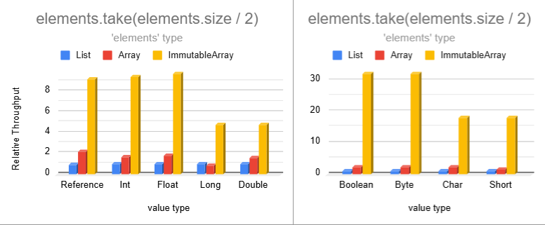

# Immutable Arrays

**Immutable Arrays** provide a safer, faster, and more memory-efficient alternative to lists while maintaining familiar
syntax. They are inline classes that compile to regular arrays but with highly-optimized operations and compile-time
immutability guarantees.

Ideal for Android, backend services, and any application seeking enhanced safety, efficiency, or performance.

[![Maven Central][maven-central-badge]][maven-central-url]
[![Licence][license-badge]][license-url]
![Top language][top-language-badge]
![Build Status][build-status-badge]
[![Stargazers][stars-badge]][stars-url]

[Key Benefits](#-key-benefits) |
[Quick Start](#-quick-start) |
[Performance](#-performance) |
[Efficiency](#-efficiency) |
[Alternatives](#-alternatives) |
[Interop & Migration](#-interop--migration) |
[Immutability Model](#-immutability-model) |
[Caveats](#-caveats) |
[FAQ](#-faq)

## ✨ Key Benefits

* ![Familiar][familiar-shield] Maintains list-like syntax for easy adoption.
* ![Fast][fast-shield] [2 to 8 times faster than lists](BENCHMARKS.md) for most operations.
* ![Efficient][efficient-shield] [Over 4X memory reduction](#-efficiency) in many common scenarios.
* ![Immutable][immutable-shield] Cannot be modified, even with casting.
* ![Type Safe][type-safe-shield] Prevents accidental mutation attempts.
* ![Efficient Builders][efficient-builders-shield] Gather elements more efficiently than mutable lists.

If you find this library useful, please consider giving it a [![GitHub stars][github-stars-shield]][github-url]
on [GitHub][github-url] and sharing it with others.

## 🚀 Quick Start

[![Latest Version][latest-version-shield]][maven-central-url] available on Maven Central.
See [dependency instructions](../README.md#installation) for more details.

```kotlin
repositories {
    mavenCentral()
}
dependencies {
    implementation("com.danrusu.pods4k:pods4k:<latest_version>")
}
```

Using Immutable Arrays feels like using lists:

```kotlin
val people = immutableArrayOf(dan, jill, bobby)

// Iterate naturally
for (person in people) {
    sendMarketingEmailTo(person)
}
// All the usual operations
val employedPeople = people.filter { it.isEmployed() }
val salaries = employedPeople.map { it.salary }
```

<details>
<summary>Creating Immutable Arrays</summary>

#### Regular Creation

```kotlin
// Empty Arrays
emptyImmutableArray<String>() // generic ImmutableArray<String>
emptyImmutableBooleanArray() // primitive ImmutableBooleanArray
// ...

// From Values
immutableArrayOf("Bob", "Jane") // ImmutableArray<String>
immutableArrayOf(1, 2, 3) // primitive int array
immutableArrayOf<Int>(1, 2, 3) // generic array with boxed integers

// Generated Elements
ImmutableArray(3) { it.toString() } // ["0", "1", "2"]
ImmutableIntArray(5) { it * it } // [0, 1, 4, 9, 16]

// From Existing Collections
listOfStrings.toImmutableArray() // ImmutableArray<String>
listOfIntegers.toImmutableArray() // primitive ImmutableIntArray
listOfIntegers.toImmutableArray<Int>() // generic ImmutableArray<Int>
// similarly with conversions from regular arrays or other iterables like Set, etc.
```

#### With Builders

Use immutable-array builders when accumulating values in complex scenarios. They're safer and more efficient than
mutable list.

```kotlin
fun getTopStocks(): ImmutableArray<Stock> {
    val topStocksBuilder = ImmutableArray.Builder<Stock>()

    addTrendingStocks(topStocksBuilder)
    addFastestGrowingStocks(topStocksBuilder)

    return topStocksBuilder.build()
}

// Primitive variants also have builders e.g. ImmutableBooleanArray.Builder()
```

#### With Build Functions

Use build functions that wrap the builder construction for when all the logic is contained in a single place:

```kotlin
val favoriteNumbers = buildImmutableIntArray {
    people.forEach { addAll(it.favoriteNumbers) }
}

// When the resulting size is known in advance, specify the initial capacity to further optimize efficiency
val top100Stocks = buildImmutableArray<Stock>(initialCapacity = 100) {
    //...
}
```

</details>

<details>
<summary>Accessing Elements</summary>

#### By Position

```kotlin
val names = immutableArrayOf("Dan", "Bob", "Jill")

names[0] // "Dan"
val (first, _, third) = names // "Dan", "Jill"

// Special access methods
names.single() // or singleOrNull()
names.first() // or firstOrNull()
names.last() // or lastOrNull()
```

#### By Condition

```kotlin
val numbers = immutableArrayOf(1, 4, 5, 6)

val firstEvenNumber = numbers.first { it % 2 == 0 } // 4
val lastOddNumber = numbers.last { it % 2 == 1 } // 5
// similarly with firstOrNull { condition } and lastOrNull { condition }

numbers.single { it % 3 == 0 } // 6
// similarly with singleOrNull
```

</details>

<details>
<summary>Iterating Elements</summary>

```kotlin
val names = immutableArrayOf("Dan", "Bob", "Jill")

// For-Loop
for (name in names) {
    println(name)
}

// ForEach
names.forEach { println(it) }
names.forEachIndexed { index, name -> println("$index: $name") }

// Sequence
names.asSequence()
    .filter { /* ... */ }
    .forEach { /* ... */ }

// Iterator
names.asIterable()

val iterator = names.iterator()
while (iterator.hasNext()) {
    //...
}
```

</details>

<details>
<summary>Conditions</summary>

#### Element Conditions

```kotlin
val names = immutableArrayOf("Dan", "Bob", "Jill")

"Jill" in names // true
names.isEmpty() // false

names.all { it.isNotEmpty() } // true
names.any { it.startsWith("B") } // true
names.none { it.length > 10 } // true
// etc.
```

#### Array Equality Conditions

Structural equality (double `==`) works as expected. Kotlin prevents using `===` (referential equality) because
Immutable Arrays are erased at compile time. Instead, use `referencesSameArrayAs` to check if two instances reference
the same underlying array:

```kotlin
val names = immutableArrayOf("Dan", "Jill")
val sameNames = immutableArrayOf("Dan", "Jill")

names == sameNames // true - structural equality
names.referencesSameArrayAs(sameNames) // false - different instance

// Optimization: most operations return original instance for identical results
names.take(100).referencesSameArrayAs(names) // true
names.filter { it.isNotEmpty() }.referencesSameArrayAs(names) // true
// etc.
```

</details>

<details>
<summary>Transformations</summary>

```kotlin
val names = immutableArrayOf("Dan", "Bob", "Jill")

names.map { it.length } // [3, 5, 4]
names.filter { it.length <= 4 } // ["Dan", "Jill"]
names.take(2) // ["Dan", "Bob"]
names.sorted() // ["Bob", "Dan", "Jill"]
// etc.
```

</details>

## 🔥 Performance

Immutable Arrays typically outperform lists by **2 to 8X** due to highly optimized operations designed for
immutability.

Preview from the [benchmarks page](BENCHMARKS.md), which includes more benchmarks along with explanations:



Smaller data types are split on the right to avoid skewing the axis due to extreme performance.


Filtering elements seems impossibly fast:


## 🎯 Efficiency

Immutable Arrays reduce memory by re-using instances when results are identical, leveraging primitives automatically,
minimizing temporary allocations, and producing perfectly-sized results without unused capacity.

Combined, these optimizations often **reduce memory consumption by over 4X** compared to lists.

### Instance Reuse

Immutable Arrays intelligently reuse instances to minimize memory:

<details>
<summary>Scenarios that return same instance</summary>

These scenarios return `this` without allocating any memory:

| Operation                                                   | Returns `this` when                 |
|-------------------------------------------------------------|-------------------------------------|
| `take(n)` & `takeLast(n)`                                   | `n >= size`                         |
| `takeWhile { condition }` & `takeLastWhile { condition }`   | all elements meet the condition     |
| `drop(n)` & `dropLast(n)`                                   | `n == 0`                            |
| `dropWhile { condition }`,                                  | first element fails condition       |
| `dropLastWhile { condition }`                               | last element fails condition        |
| `sorted()` & `sortedDescending()`                           | `size <= 1`                         |
| `sortedBy { selector }` & `sortedByDescending { selector }` | `size <= 1`                         |
| `sortedWith(comparator)`                                    | `size <= 1`                         |
| `shuffled()` & `shuffled(random)`                           | `size <= 1`                         |
| `distinct()` & `distinctBy { selector }`                    | `size <= 1`                         |
| `plus(otherArray)`                                          | `otherArray.isEmpty()` & vice versa |

These scenarios track which elements should be included, but return the original instance when all elements match.

| Operation                                              | Returns `this` when               |
|--------------------------------------------------------|-----------------------------------|
| `filter { condition }` & `filterIndexed { condition }` | all elements meet the condition   |
| `filterNot { condition }`                              | all elements fail the condition   |
| `distinct()`                                           | all elements are distinct         |
| `distinctBy { selector }`                              | selector produces distinct values |

</details>

<details>
<summary>Scenarios that return EMPTY singleton</summary>

These scenarios return the `EMPTY` singleton without allocating any memory:

| Operation                                                   | Returns `EMPTY` singleton when      |
|-------------------------------------------------------------|-------------------------------------|
| `emptyImmutableArray()` & 8 primitive variants              | always                              |
| `immutableArrayOf()`                                        | no arguments provided               |
| `ImmutableArray(n) { init }` & 8 primitive variants         | `n == 0`                            |
| `regularArray.toImmutableArray()`                           | `isEmpty()`                         |
| `copyFrom(array, startIndex, size)`                         | `size == 0`                         |
| `take(n)` & `takeLast(n)`                                   | `n == 0`                            |
| `takeWhile { condition }`                                   | first element fails condition       |
| `takeLastWhile { condition }`                               | last element fails condition        |
| `drop(n)` & `dropLast(n)`                                   | `n >= size`                         |
| `dropWhile { condition }` & `dropLastWhile { condition }`   | all elements fail condition         |
| `map { transform }` & `mapIndexed { transform }`            | `isEmpty()`                         |
| `sorted()` & `sortedDescending()`                           | `isEmpty()`                         |
| `sortedBy { selector }` & `sortedByDescending { selector }` | `isEmpty()`                         |
| `sortedWith(comparator)`                                    | `isEmpty()`                         |
| `shuffled()` & `shuffled(random)`                           | `isEmpty()`                         |
| `distinct()` & `distinctBy { selector }`                    | `isEmpty()`                         |
| `plus(otherArray)`                                          | `isEmpty() && otherArray.isEmpty()` |
| `toTypedImmutableArray()`                                   | `isEmpty()`                         |
| `zip(other)`                                                | `isEmpty()` or `other.isEmpty()`    |
| `chunked(chunkSize)`                                        | `isEmpty()`                         |
| `windowed(windowSize)`                                      | `isEmpty()`                         |

These scenarios track which elements should be included, but return the `EMPTY` singleton when no elements match.

| Operation                                                      | Returns `EMPTY` singleton when                        |
|----------------------------------------------------------------|-------------------------------------------------------|
| `ImmutableArray.Builder.build()` & 8 primitive variants        | `isEmpty()`                                           |
| `immutableArrayOfNotNull(...)`                                 | all arguments are null                                |
| `buildImmutableArray { ... }` & 8 primitive variants           | no elements added                                     |
| `iterable.toImmutableArray()`                                  | the iterable is empty                                 |
| `sequence.toImmutableArray()`                                  | the sequence is empty                                 |
| `filter { condition }` & `filterIndexed { condition }`         | all elements fail the condition                       |
| `filterNot { condition }`                                      | all elements meet the condition                       |
| `filterNotNull()`                                              | all elements are null                                 |
| `mapNotNull { transform }` & `mapIndexedNotNull { transform }` | `transform` always produces null                      |
| `flatMap { transform }` & `flatMapIndexed { transform }`       | `isEmpty()` or `transform` produces all empty results |
| `flatten()`                                                    | `isEmpty()` or all nested arrays are empty            |
| `distinct()` & `distinctBy { selector }`                       | `isEmpty()`                                           |

</details>

### Element Memory Consumption

Immutable Arrays use significantly less memory to store values:


Regular arrays are excluded since their operations typically yield lists, leading to the above memory usage. However,
Immutable Arrays automatically use optimal memory layouts.

<details>
<summary>Memory layout</summary>

Here's an example where we code naturally and automatically benefit from primitives:


Note that the `values` Immutable Array variable directly references a primitive `IntArray` in the generated bytecode.

Immutable Array operations produce Immutable Arrays in order to preserve immutability guarantees. However, most
regular-array operations produce lists resulting in the following memory layout:


Unlike lists or regular arrays, Immutable Arrays also dynamically switch to the most optimal data type:

```kotlin
// ImmmutableArray<Person>
val people = immutableArrayOf(dan, bob, jill)

// ImmutableFloatArray storing primitive floats!
val peopleWeights = people.map { it.weightKg }
```

</details>

The `Average Memory Consumption` chart uses the cache rate of each data type to compute the weighted-average element
size given the cached and uncached sizes:

<details>
<summary>Uncached element size</summary>

Immutable Arrays store primitives whereas lists store references to wrapper objects. Each wrapper incurs extra overhead
from the object header and padding. Combined with the reference to each wrapper, this results in much higher memory
consumption:


</details>

<details>
<summary>Cached element size</summary>

The JVM maintains a small cache of boxed primitive values:

* All `Boolean` and `Byte` values.
* `Char` ASCII values between `0` and `127`.
* `Short`, `Int`, & `Long` values between `-128` and `127`.
* `Float` and `Double` values are never cached.

Storing references to cached wrappers often takes more memory than storing the values directly with Immutable Arrays:


Note that the cache is bypassed when calling the constructor directly (E.g.`java.lang.Boolean(true)`,
`java.lang.Integer(0)`, etc.). This can happen in generic utilities that use reflection to fetch the class by name and
call the constructor making it easy to miss these types of inefficiencies.

</details>

<details>
<summary>Estimated cache rates</summary>

These estimates represent the average percentage of values that use the JVM cache for use-cases that store values in
lists. Lists typically store user data as opposed to all values that we encounter in code. For example, loops are common
and loop counters are usually small, but storing loop counters in lists isn't common.

| Data Type         | Caching Range    | Estimated Cache Rate |
|-------------------|------------------|----------------------|
| Boolean           | `true & false`   | 100%                 |
| Byte              | `-128 to 127`    | 100%                 |
| Char              | ASCII `0 to 127` | 90%                  |
| Short             | `-128 to 127`    | 70%                  |
| Int               | `-128 to 127`    | 50%                  |
| Float             | N/A              | 0%                   |
| Long <sup>1</sup> | `-128 to 127`    | 5%                   |
| Double            | N/A              | 0%                   |

<sup>1</sup> `Long` is chosen when anticipating larger values, such as when storing salaries in cents, but typical
salaries exceed $1.27 (127 cents), making the cache rarely useful.

</details>

## 🏆 Alternatives

Immutable Arrays are the only solution providing type safety, efficiency, and performance:

| Feature                  | Immutable Arrays | Regular Arrays | Read-only Lists    | Unmodifiable Lists | Java Immutable Lists |
|--------------------------|------------------|----------------|--------------------|--------------------|----------------------|
| True Immutability        | ✅                | ❌              | ❌ <sup>1</sup>     | ❌ <sup>2</sup>     | ✅                    |
| Memory Efficiency        | ⭐⭐               | ⭐              | ❌                  | ❌                  | ❌                    |
| Performance              | ⭐⭐               | ⭐              | ❌                  | ❌                  | ❌                    |
| Compile-time Safety      | ✅                | ❌              | ✅ / ❌ <sup>1</sup> | ❌ <sup>3</sup>     | ❌ <sup>3</sup>       |
| Proper equals & hashCode | ✅                | ❌              | ✅                  | ✅                  | ✅                    |
| Meaningful toString()    | ✅                | ❌              | ✅                  | ✅                  | ✅                    |

<sup>1</sup> Casting read-only lists to MutableList enables mutation

<sup>2</sup> Unmodifiable lists can be modified via the backing list

<sup>3</sup> Immutability in Java APIs is enforced with runtime exceptions

### Benefits over regular arrays

<details>
<summary>✅ Proper equals / hashCode</summary>

Unlike regular arrays, Immutable Arrays implement equals & hashCode correctly for structural equality:

```kotlin
// ✅ returns true
immutableArrayOf("Dan", "Bob") == immutableArrayOf("Dan", "Bob")

// ❌ returns false despite identical contents
arrayOf("Dan", "Bob") == arrayOf("Dan", "Bob")
```

Since we can compare lists directly, developers occasionally attempt to do the same with regular arrays. This can lead
to subtle defects when it's not obvious that the code relies on array equality:

```kotlin
data class Order(val id: Long, private val products: Array<Product>)

val rejectedOrders = mutableSetOf<Order>()
// ❌ Oops, attempting to add Orders to a hashSet will make use of the auto-generated 
// equals & hashCode methods from the Order data class. This will in turn rely on 
// the defective equals & hashCode implementation of regular arrays
```

Swapping `Array<Product>` with `ImmutableArray<Product>` will fix this defect scenario.

</details>

<details>
<summary>✅ Safe asList() – No mutation backdoor</summary>

Calling `asList()` on an Immutable Array provides a truly immutable view. However, with regular arrays the view can be
cast into a `MutableList` to mutate the original array:

```kotlin
val array = arrayOf("Dan", "Jill")
val list = array.asList()

(list as MutableList<String>)[0] = "Bob"
array[0] // ❌ "Bob" - original array was mutated!
```

</details>

<details>
<summary>✅ Readable toString()</summary>

Unlike regular arrays, Immutable Arrays provide a readable `toString()` output:

```kotlin
println(immutableArrayOf("Dan", "Bob")) // ✅ [Dan, Bob]

println(arrayOf("Dan", "Bob")) // ❌ [Ljava.lang.String;@7d4991ad
```

</details>

<details>
<summary>✅ Faster operations with lower memory consumption</summary>

Regular arrays are often used for memory and performance benefits, but many operations produce lists, negating those
benefits and adding auto-boxing overhead.

```kotlin
val weights = doubleArrayOf(1.5, 3.0, 10.2, 15.7, 2.0)

// ❌ Oops, this creates a List<Double> auto-boxing each value!
val largeWeights = weights.filter { it > 10.0 }
```

Unlike regular arrays, dozens of Immutable Array operations have specializations that produce the most optimal
representation so that clean code is efficient by default:

```kotlin
val people = immutableArrayOf(
    Person(name = "Dan", age = 3),
    Person(name = "Bob", age = 4),
) // ImmutableArray<Person>

val ages = people.map { it.age } // ✅ ImmutableIntArray because age is an Int
```

These specializations unlocked additional optimizations such as using `arraycopy` to copy multiple elements in bulk for
operations like `take`, `takeWhile`, `drop`, `dropWhile`, `dropLast`, `dropLastWhile`, `flatMap`, `flatten`, etc.

</details>

<details>
<summary>✅ Efficient sharing of encapsulated data</summary>

Regular arrays require defensive copying before sharing since their elements can be reassigned. While `asList()` might
seem like an alternative, it's unsafe for generic arrays (can be cast to `MutableList` to mutate the original array) and
inefficient for primitive arrays due to repeated auto-boxing on every access.

Immutable arrays can be safely shared resulting in cleaner and more efficient code.
</details>

<details>
<summary>✅ Covariant - Same subtype relationship as element types</summary>

Kotlin treats arrays as invariant to prevent mutation defects - for example, preventing `Array<String>` from being
passed as `Array<Any>`, which would compile code that attempts to add non-String elements.

Immutable Arrays safely restore covariance since they can't be modified. Immutable Arrays follow the same subtyping
relationships as their elements, making the code more intuitive and flexible without sacrificing safety. For example,
`ImmutableArray<Manager>` can be treated as an `ImmutableArray<Person>` because `Manager` is a subtype of `Person`.

</details>

### Benefits over read-only lists

<details>
<summary>✅ Casting doesn't introduce backdoor for mutation</summary>

Read-only lists can be mutated by casting to `MutableList`:

```kotlin
val values = listOf(1, 2, 3)
(values as MutableList)[0] = 100 // backdoor to mutation
println(values) // ❌ [100, 2, 3]
```

Immutable arrays don't have this backdoor:

```kotlin
val values = immutableArrayOf(1, 2, 3)
values[0] = 100 // Compiler error: No set method providing array access

@Suppress("CAST_NEVER_SUCCEEDS")
(values as IntArray)[0] = 100
// ✅ ClassCastException: ImmutableIntArray cannot be cast to [I
```

</details>

<details>
<summary>✅ More memory efficient</summary>

Immutable Arrays reduce memory consumption by over 4X compared to lists in most scenarios. See
the [Efficiency](#-efficiency) comparison for details.

</details>

<details>
<summary>✅ Higher performance</summary>

Immutable Arrays are between 2 - 8X faster than lists for most operations. See the [Benchmark page](BENCHMARKS.md) for
details.

</details>

### Benefits over unmodifiable lists

<details>
<summary>✅ Avoids delayed-processing defects</summary>

Using `Collections.unmodifiableList(...)` wraps a mutable list without copying it. While the wrapper prevents mutation,
the underlying list can still be modified. This can introduce subtle defects:

* A separate thread mutates the underlying list after the view is shared.
* Processing is delayed (e.g. via a worker queue) while the original list changes.

Immutable arrays don't have this concern as they can never be mutated.

</details>

<details>
<summary>✅ No mutation exceptions at runtime</summary>

Unmodifiable lists implement the Java `List` interface and override mutating methods to throw exceptions. Although
mutation is prevented at the view level, bad usages result in runtime exceptions affecting the user experience.

Immutable Arrays prevent mutation at compile time, eliminating this entire class of defects.

</details>

<details>
<summary>✅ More memory efficient</summary>

Unmodifiable lists have the same memory drawbacks as read-only lists
(see [Benefits over read-only lists](#benefits-over-read-only-lists)) along with a tiny extra overhead from the wrapper.

</details>

<details>
<summary>✅ Higher performance</summary>

Unmodifiable lists have similar performance drawbacks as read-only lists (
see [Benefits over read-only lists](#benefits-over-read-only-lists)) but slightly worse due to the extra layer of
indirection caused by the view wrapper.

</details>

### Benefits over Java immutable lists

<details>
<summary>✅ No mutation exceptions at runtime</summary>

Java-based immutable lists, like Guava's, extend the Java `List` interface but rely on runtime exceptions to prevent
modifications. Although this prevents mutation, bad usages result in runtime exceptions affecting the user experience.

Attempting to mutate an immutable array won't even compile preventing this category of defects altogether.

</details>

<details>
<summary>✅ More memory efficient</summary>

Immutable lists have the same memory drawbacks as read-only lists
(see [Benefits over read-only lists](#benefits-over-read-only-lists))

</details>

<details>
<summary>✅ Higher performance</summary>

Immutable lists have the same performance drawbacks as read-only lists
(see [Benefits over read-only lists](#benefits-over-read-only-lists)).

</details>

## 🤝 Interop & Migration

Immutable Arrays can be exposed as regular collections in constant-time without copying elements. This is achieved
through tiny immutable wrappers backed by the same array, making it highly efficient to pass them to existing APIs:

```kotlin
val people = immutableArrayOf(dan, bob, jill)

// List wrapper backed by the same array, supports random access
people.asList()

// Iterable wrapper backed by the same array, forces sequential access via iterators
people.asIterable()
```

Elements can also be copied into regular arrays or standalone lists:

```kotlin
val weights = immutableArrayOf(1.0f, 2.0f, 3.0f) // ImmutableFloatArray

// copy to equivalent regular array
weights.toArray() // FloatArray

// copy to regular typed array
weights.toTypedArray() // Array<Float>

// copy to standalone read-only List
weights.toList() // List<Float>
```

<details>
<summary>Choosing between asList(), asIterable(), and toList()</summary>

Use `asList()` by default. It provides zero-copy views that auto-box primitives lazily to minimize people memory
consumption and GC pressure. The `size` property along with random access makes it more efficient than `asIterable()`
for most follow-on operations.

Use `toList()` only for primitive variants (e.g. `ImmutableFloatArray`) when elements are accessed repeatedly. This
auto-boxes and copies all elements into a standalone list avoiding repeated boxing overhead.

</details>

<details>
<summary>Transforming regular data structures into Immutable Arrays</summary>

Use `toImmutableArray()` to copy elements from regular data structures into Immutable Arrays:

```kotlin
regularArray.toImmutableArray()

list.toImmutableArray()

iterable.toImmutableArray()

sequence.toImmutableArray()

// Consider splitting large sequences into manageable chunks first
sequence
    .chunked(chunkSize)
    .forEach { chunk -> processImmutableArray(chunk.toImmutableArray()) }
```

</details>

<details>
<summary>Replacing mutable lists</summary>

Replace `MutableList` accumulation with Immutable-Array builders. They are append-only making them safer as they prevent
helper functions from removing or replacing previously added elements. Immutable-Array builders also contain many
optimizations that make them faster and more efficient than accumulating elements in a mutable list.

```kotlin
val interestingStocksBuilder = ImmutableArray.Builder<Stock>() // ImmutableArray.Builder<Stock>
for (stock in topStocks) {
    if (!stock.isInteresting()) continue

    interestingStocksBuilder += stock
}
val interestingStocks = interestingStocksBuilder.build() // ImmutableArray<Stock>

// primitive variants also have builders e.g. ImmutableBooleanArray.Builder()
```

</details>

<details>
<summary>Migrating referential equality checks</summary>

Structural equality (`==`) works as expected - no changes needed.

For referential equality, replace `===` with `referencesSameArrayAs()`:

```kotlin
// Before (lists) 
if (values === otherValues) doSomething()

// After (Immutable Arrays)
// checks if both reference the same underlying array instance
if (values.referencesSameArrayAs(otherValues)) doSomething()
```

Note: This condition triggers more often because immutability enables instance reuse (e.g. empty Immutable Arrays share
an `EMPTY` singleton, and most operations return the original when results are identical).
See [Instance Reuse](#instance-reuse) for details.

</details>

We recommend transitioning to Immutable Arrays gradually instead of replacing all lists at once. This can be tackled at
the function, class, package, or module level. The boundaries that interact with the rest of the application can expose
Immutable Arrays as regular collections using `asList()`, `asIterable()`, or `toList()`. As adoption progresses, the
boundary layers can be updated to operate on Immutable Arrays directly for optimal efficiency.

## 📘 Immutability Model

Immutable Arrays enforce immutability at the type and API level: no mutating operations are exposed. All transformation
operations leave the original unchanged and return Immutable Arrays, preserving immutability across chained operations.

Immutability is shallow: referenced objects may themselves be mutable. This is the standard model used by immutable
collections across programming languages.

As with all JVM immutable collection libraries (including Guava and `kotlinx.collections.immutable`), immutability is
enforced by language constraints rather than as a security mechanism. Low-level JVM mechanisms (such as reflection,
bytecode instrumentation, or native code) operate outside this model and are considered out of scope.

## 📌 Caveats

<details>
<summary>No identity</summary>

#### Reference equality:

Using `===` with Immutable Arrays is forbidden by the Kotlin compiler because value classes don't have object identity.
Use `values.referencesSameArrayAs(otherValues)` to check whether two Immutable Arrays reference the same array instance.

#### Identity hashCode:

Avoid `System.identityHashCode(immutableArray)`. Immutable Arrays get auto-boxed when passed as `Any` so you might get a
different hash code for the same array every time.

#### Synchronization:

Using `synchronized(immutableArray) { }` will generate a compiler warning because value classes don't have object
identity. It locks on a temporary auto-boxed wrapper object making it ineffective for thread safety.

</details>

<details>
<summary>Auto-boxing</summary>

Immutable Arrays are zero-cost abstractions eliminated at compile time—code operates on the underlying array directly.

When an Immutable Array is passed as a generic type or `Any`, the compiler auto-boxes the entire array in a single
wrapper object. Unlike lists (which box each primitive element), the contiguous element representation remains unchanged
preserving memory and performance benefits.

Although this overhead is tiny, explicitly specifying Immutable-Array types avoids auto-boxing. Auto-boxing is also
avoided for generic parameters of inline functions. For example, `with(immutableArray) { ... }` avoids auto-boxing
because `with` is declared as an inline function so the body gets inlined into each call site replacing the generic type
with the actual type.

Here are some examples to get a better idea of where auto-boxing occurs:

```kotlin
// no auto-boxing.  `names` references the underlying array directly
val names = immutableArrayOf("Dan", "Bob")

// no auto-boxing because `with` is an inline function so the generic parameter gets replaced at compile time
with(names) {
    println(this.size)
}

// casting induces auto-boxing.  This prevents casting an Immutable Array as a regular array 
names as Any

println(names) // auto-boxing (passed as Any)
println(names.toString()) // avoids auto-boxing (rarely matters)

// Even though we're explicitly specifying Immutable Arrays as the generic type, the Pair class 
// isn't hardcoded to work with Immutable Arrays, so each immutable array will be auto-boxed
val arrays: Pair<ImmutableArray<String>, ImmutableArray<String>> = Pair(
    immutableArrayOf("Dan", "Bob"),
    immutableArrayOf("Jill", "Jane"),
)

// auto-boxing because the immutable array is used as a generic receiver
names.genericExtensionFunction()

fun <T> T.genericExtensionFunction() {
    // ...
}
```

When using reflection to traverse the object graph, reflective code will encounter the underlying array directly except
for the auto-boxing scenarios, in which case it will encounter the tiny wrapper.

For optimal performance, we recommend explicitly using the immutable array types for everything that expects to work
with Immutable arrays as this avoids auto-boxing. Passing Immutable Arrays to generic inline functions also avoids
auto-boxing, as the generic parameter is replaced at compile time.

</details>

<details>
<summary>Experimental Kotlin features</summary>

This library leverages the following experimental Kotlin features that may evolve in future Kotlin releases:

* [Overload resolution by lambda return type](https://kotlinlang.org/api/latest/jvm/stdlib/kotlin/-overload-resolution-by-lambda-return-type/)
    * This allows overloaded functions that only differ in the lambda return type. This enables optimized
      specializations that auto-bind to the most optimal return type. Eg. `people.map { it.weightKg }` returns an
      `ImmutableFloatArray` when `weightKg` is a float.
    * This feature was introduced in Kotlin 1.4 and is used extensively throughout the Kotlin standard library.
    * Vote and comment on this [YouTrack ticket](https://youtrack.jetbrains.com/issue/KT-51107) to stabilize this
      feature.
* [Custom equals in value classes](https://youtrack.jetbrains.com/issue/KT-24874/Support-custom-equals-and-hashCode-for-value-classes)
    * This enables overriding the `equals` & `hashCode` methods for inline value classes.
    * This was added for the JVM IR backend (which handles both Android & regular backend JVM development) in Kotlin 1.9
      but hasn't been announced yet because the other multiplatform backends were not ready.
    * Vote and comment on this [YouTrack ticket](https://youtrack.jetbrains.com/issue/KT-24874) to raise the importance
      of this feature so that Immutable Arrays can eventually support Kotlin multiplatform.

</details>

## 🙋 FAQ

<details>
<summary>Does it support Kotlin Multiplatform (KMP)?</summary>

Our goal is to turn this into a Kotlin Multiplatform library. We already took steps to replace usages of the Java
standard library with equivalents from the Kotlin standard library. This will make it a fairly easy transition as most
of the code would end up in the common module.

The main blocker is that JetBrains only added custom-equals-for-values-classes to the JVM backend (which supports
both JVM and Android) and put the other multi-platform targets on hold to focus on the K2 compiler. The K2 initiative
was a massive undertaking so they forgot about this feature. Vote and comment on
this [YouTrack ticket](https://youtrack.jetbrains.com/issue/KT-24874) to help unblock us.

</details>

<details>
<summary>How can we skip recomposition with Compose?</summary>

Compose isn't aware that Immutable Arrays cannot be modified so we need to append the following to
the [stability configuration file][stability-configuration-url]:

```text
// Consider ImmutableArray<T> as stable when T is stable
com.danrusu.pods4k.immutableArrays.ImmutableArray<*>

// Consider primitive immutable arrays as stable as the contents can never be modified
com.danrusu.pods4k.immutableArrays.ImmutableBooleanArray
com.danrusu.pods4k.immutableArrays.ImmutableByteArray
com.danrusu.pods4k.immutableArrays.ImmutableCharArray
com.danrusu.pods4k.immutableArrays.ImmutableShortArray
com.danrusu.pods4k.immutableArrays.ImmutableIntArray
com.danrusu.pods4k.immutableArrays.ImmutableFloatArray
com.danrusu.pods4k.immutableArrays.ImmutableLongArray
com.danrusu.pods4k.immutableArrays.ImmutableDoubleArray
```

Note that mutable elements can be stable when the mutable parts use [MutableState][mutable-state-url] to automatically
notify the Compose runtime when a value changed and trigger recomposition appropriately.

</details>

<details>
<summary>Why don't Immutable Arrays implement the List interface?</summary>

There are several reasons:

1. **Performance**: If the primitive variants implemented the List interface, (eg.`ImmutableFloatArray` implemented
   `List<Float>`), elements would be auto-boxed on every access affecting the memory and performance of the library.
2. **Immutability**: If Immutable Arrays implement `List`, the Kotlin standard library operations overshadow the
   optimized
   versions from this library. This affects performance and also breaks immutability guarantees since those would
   produce read-only lists that can be mutated through casting.
3. **API Integrity**: The `List` interface contains methods with `List` return types that we wouldn't want to be used.
   Using these would affect performance, but most importantly, this would make usages accidentally cross over into the
   list world where the immutability guarantees no longer exist. Throwing `OperationNotSupportedException` would violate
   the `List` contract and leading to unpredictable downstream behavior.

</details>

[maven-central-badge]: https://img.shields.io/maven-central/v/com.danrusu.pods4k/pods4k?style=for-the-badge

[license-badge]: https://img.shields.io/github/license/daniel-rusu/pods4k?style=for-the-badge

[top-language-badge]: https://img.shields.io/github/languages/top/daniel-rusu/pods4k?style=for-the-badge

[build-status-badge]: https://img.shields.io/github/actions/workflow/status/daniel-rusu/pods4k/ci.yml?style=for-the-badge&label=CI

[stars-badge]: https://img.shields.io/github/stars/daniel-rusu/pods4k?style=for-the-badge

[familiar-shield]: https://img.shields.io/badge/Clean_%26_Familiar-blue

[fast-shield]: https://img.shields.io/badge/Blazing_Fast-blue

[efficient-shield]: https://img.shields.io/badge/Memory_Efficient-blue

[immutable-shield]: https://img.shields.io/badge/True_Immutability-blue

[type-safe-shield]: https://img.shields.io/badge/Type_Safety-blue

[efficient-builders-shield]: https://img.shields.io/badge/Efficient_Builders-blue

[github-stars-shield]: https://img.shields.io/github/stars/daniel-rusu/pods4k?label=Star

[latest-version-shield]: https://img.shields.io/maven-central/v/com.danrusu.pods4k/pods4k?label=Latest%20Version

[github-url]: https://github.com/daniel-rusu/pods4k

[stars-url]: https://github.com/daniel-rusu/pods4k/stargazers

[maven-central-url]: https://central.sonatype.com/artifact/com.danrusu.pods4k/pods4k

[license-url]: https://github.com/daniel-rusu/pods4k/blob/main/LICENSE

[stability-configuration-url]: https://developer.android.com/develop/ui/compose/performance/stability/fix#configuration-file

[mutable-state-url]: https://developer.android.com/reference/kotlin/androidx/compose/runtime/MutableState